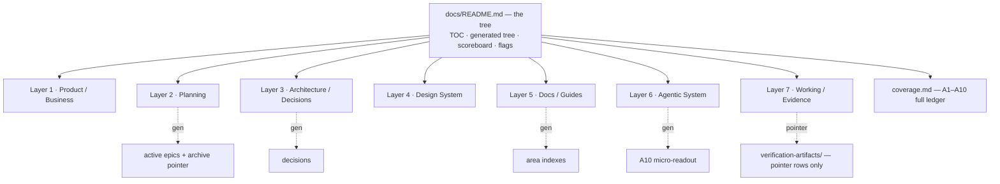

# Project Documentation — the System Map (the Tree)

> This file IS the tree: root, branch tables, and machine-derived layer lists all live here;
> leaves stay in their own files. The map is generated — never hand-sync.

## The tree — shape at a glance

## TL;DR — this repo at a glance

- **Stack:** React 19 + Vite + TypeScript (frontend) · Express + Prisma on PostgreSQL (backend; **NestJS 11 shell-swap in progress** — D1/D7) · Redis/Upstash cache · Vercel (FE) + Railway (BE) + Neon DB, Terraform IaC.
- **State:** Context + reducers + shared Zustand stores (`userStore`, `uiStore`, `hubStore`) plus feature stores (mnemonic, quizSession, reading, audio).
- **Epics:** 24 (NestJS shell migration, `planned` D7), 41 (traditional toggle, `deferred` Phase-4) active; 5 (vocab-list UI), 15 (SRS retention), 16 (word examples) archived → [archive](business-requirements/archive/README.md).
- **Ratified decisions:** BM-1 business model · epic plan 25–40 + OI-1…OI-10 · D1/D7 (NestJS 11 shell-swap) · ADR-001…005 design ADRs · ADR-006 `proposed`. Full list in `.github/decision-log.json`.
- **Design system:** `DESIGN.md` tokens machine-linted (`green`) · component registry `green` (`check:registry-stories` green) · page inventory **4/16 conform · 12/16 diverges (2 doc-only)** — the living divergence tracker.
- **Gates:** canonical two-tier gate table in `project-workflow.instructions.md`; local solo-dev gates (`check:registry-stories`, `check:page-inventory`, `design-audit`).

## What are you here for?

| You are…             | Start here                                                                                                                                                                      |
| -------------------- | ------------------------------------------------------------------------------------------------------------------------------------------------------------------------------- |
| New developer        | [`guides/getting-started/quickstart.md`](guides/getting-started/quickstart.md) → `project-overview.md` → this map's Docs/Guides layer                                           |
| Agent writing code   | [`.github/AGENTS.md`](../.github/AGENTS.md) + [`copilot-instructions.md`](../.github/copilot-instructions.md) → file-scoped `.instructions.md` (auto-attach)                    |
| Design work          | [`DESIGN.md`](../DESIGN.md) → [`guides/design/page-archetypes.md`](guides/design/page-archetypes.md) → [`guides/design/design-reasoning.md`](guides/design/design-reasoning.md) |
| Business / planning  | [`business/business-model.md`](business/business-model.md) (BM-1) → [`planning/epics-25-40.md`](planning/epics-25-40.md)                                                        |
| Auditing / freshness | this map → [`project-workflow.instructions.md`](../.github/instructions/project-workflow.instructions.md) gate table → `check:*` scripts                                        |

---

## Status vocabulary

The per-class status vocabulary lives in
[`documentation-standards.instructions.md`](../.github/instructions/documentation-standards.instructions.md)
(§ Leaf Front-Matter Standard) — the instruction owns the conventions.

---

**Last Updated:** August 18, 2026

<!-- system-map:generated -->
<!-- generated 2026-08-21 by scripts/generate-system-map.mjs — DO NOT EDIT; run `npm run generate:system-map` -->

## The tree

Generated full tree — every tracked leaf (purpose · status · link), nested layer → small branch. `review` = stale > 6 weeks (machine override); scanned .md leaves must carry YAML front-matter (purpose/status/last-verified) — absence is a hard `check:system-map` failure; HTML leaves use a `<!-- last-verified: -->` marker.

- [Layer 1 · Product / Business — active · 5 leaves](#layer-1)
- [Layer 2 · Planning — planned · 8 leaves](#layer-2)
- [Layer 3 · Architecture / Decisions — planned · 4 leaves](#layer-3)
- [Layer 4 · Design System — review · 9 leaves](#layer-4)
- [Layer 5 · Docs / Guides — review · 124 leaves](#layer-5)
- [Layer 6 · Agentic System — active · 31 leaves](#layer-6)
- [Layer 7 · Working / Evidence — active · 1 leaves](#layer-7)

Layer 1 · Product / Business — active · 5 leaves

#### Model

| Purpose                                                                                            | Status   | Link                                                          |
| -------------------------------------------------------------------------------------------------- | -------- | ------------------------------------------------------------- |
| Area index for the business domain — the locked product/business model and its supporting research | active   | [docs/business/README.md](business/README.md)                 |
| Locked business model — demo-guest + data-driven learning road                                     | ratified | [docs/business/business-model.md](business/business-model.md) |

#### Research

| Purpose                                                                                                        | Status | Link                                                                                              |
| -------------------------------------------------------------------------------------------------------------- | ------ | ------------------------------------------------------------------------------------------------- |
| Official ratified feature inventory — post-calibration feature set for a registered user (all phases unlocked) | active | [docs/business/research/feature-inventory.md](business/research/feature-inventory.md)             |
| 2026 trend/standard fact-check × LLM/RAG-readiness audit of the feature inventory (Axes 1–2)                   | active | [docs/business/research/feature-validation-2026.md](business/research/feature-validation-2026.md) |
| 2026 research round parsed findings (M1–M19) — source data for the business model validation                   | active | [docs/business/research/research-findings-2026.md](business/research/research-findings-2026.md)   |

Layer 2 · Planning — planned · 8 leaves

#### Planning

| Purpose                                                                                    | Status   | Link                                                    |
| ------------------------------------------------------------------------------------------ | -------- | ------------------------------------------------------- |
| Area index for ratified planning docs — epics 25–40 + the D7 backend shell-swap track      | active   | [docs/planning/README.md](planning/README.md)           |
| Ratified re-sliced epic plan 25–40 (calibration + AI roadmap) + OI-1…OI-10 decision record | ratified | [docs/planning/epics-25-40.md](planning/epics-25-40.md) |

#### Business requirements

| Purpose                                                                                                | Status   | Link                                                                                                                                  |
| ------------------------------------------------------------------------------------------------------ | -------- | ------------------------------------------------------------------------------------------------------------------------------------- |
| Area index for business requirements, epics, user stories, and planning docs                           | active   | [docs/business-requirements/README.md](business-requirements/README.md)                                                               |
| NestJS 11 shell-swap — mechanical migration running parallel to epics 25–28, completing before epic-29 | planned  | [docs/business-requirements/epic-24-nestjs-shell-migration/README.md](business-requirements/epic-24-nestjs-shell-migration/README.md) |
| Global Simplified↔Traditional character toggle for Phase 4 learners                                    | deferred | [docs/business-requirements/epic-41-traditional-characters/README.md](business-requirements/epic-41-traditional-characters/README.md) |

#### Issue implementation

| Purpose                                                                   | Status   | Link                                                                                                                                |
| ------------------------------------------------------------------------- | -------- | ----------------------------------------------------------------------------------------------------------------------------------- |
| Area index for technical implementation docs (epics and stories)          | active   | [docs/issue-implementation/README.md](issue-implementation/README.md)                                                               |
| Epic 24 implementation — NestJS 11 shell-swap (D7), Express until epic-29 | planned  | [docs/issue-implementation/epic-24-nestjs-shell-migration/README.md](issue-implementation/epic-24-nestjs-shell-migration/README.md) |
| Epic 41 implementation — 简体/繁體 global toggle (Phase 4, deferred)      | deferred | [docs/issue-implementation/epic-41-traditional-characters/README.md](issue-implementation/epic-41-traditional-characters/README.md) |

Layer 3 · Architecture / Decisions — planned · 4 leaves

| Purpose                                                                                                                                 | Status   | Link                                                                                    |
| --------------------------------------------------------------------------------------------------------------------------------------- | -------- | --------------------------------------------------------------------------------------- |
| Index of Architecture Decision Records (ADRs) — ADR-001…005 in design-reasoning.md, ADR-006 here, plus the machine decision-log catalog | active   | [docs/guides/adr/README.md](guides/adr/README.md)                                       |
| Machine catalog of ADR/D/OI/BM decisions                                                                                                | planned  | [.github/decision-log.json](../.github/decision-log.json)                               |
| High-level system design decisions, architectural patterns, and technology choices                                                      | active   | [docs/architecture.md](architecture.md)                                                 |
| 4 data tiers — storage, cache, and module dependency rules for content vs user data                                                     | proposed | [docs/guides/adr/data-tiering-architecture.md](guides/adr/data-tiering-architecture.md) |

Layer 4 · Design System — review · 9 leaves

#### Design docs

| Purpose                                                                                                                                                                                        | Status | Link                                                                                  |
| ---------------------------------------------------------------------------------------------------------------------------------------------------------------------------------------------- | ------ | ------------------------------------------------------------------------------------- |
| Design tokens and component specifications for the PinyinPal Mandarin learning platform. Amber primary on warm slate backgrounds.                                                              | active | [DESIGN.md](../DESIGN.md)                                                             |
| Define "good" operationally — criteria × measurement × threshold — the scored quality bar for designs                                                                                          | active | [docs/guides/design/design-quality-rubric.md](guides/design/design-quality-rubric.md) |
| Enable design decision-making — not just _what_ tokens exist, but _why_ and _when_ to use them                                                                                                 | active | [docs/guides/design/design-reasoning.md](guides/design/design-reasoning.md)           |
| The page-level contract — a finite set of named Focus-First page skeletons every page parameterizes                                                                                            | active | [docs/guides/design/page-archetypes.md](guides/design/page-archetypes.md)             |
| The canonical per-epic design-spec template — one doc per UI epic (e.g. `features/*/docs/design.md`), replacing each `UI: … — design spec TBD` line                                            | active | [docs/guides/design/per-epic-design-spec.md](guides/design/per-epic-design-spec.md)   |
| The 12 UIUX fundamentals applied to PinyinPal, the 7-layer QA pyramid, the consolidated AI-slop checklist, and the 2026 fact-check corrections — the committed source of record for UI quality | active | [docs/guides/design/uiux-fundamentals.md](guides/design/uiux-fundamentals.md)         |
| Reference index of the 29 verified UI/UX study resources (what each teaches, its PinyinPal application, and adoption status) — the entry point for future UI research                          | active | [docs/guides/design/uiux-resources.md](guides/design/uiux-resources.md)               |

#### Catalogs

| Purpose                                                                                    | Status   | Link                                                                  |
| ------------------------------------------------------------------------------------------ | -------- | --------------------------------------------------------------------- |
| Shared-component registry — the machine-checked catalog                                    | green    | [.github/component-registry.json](../.github/component-registry.json) |
| Page route→archetype→story consistency ledger — 13/16 conform · 3/16 diverges (2 doc-only) | diverges | [.github/page-inventory.json](../.github/page-inventory.json)         |

Layer 5 · Docs / Guides — review · 124 leaves

#### Getting started

| Purpose                                                                             | Status     | Link                                                                                            |
| ----------------------------------------------------------------------------------- | ---------- | ----------------------------------------------------------------------------------------------- |
| Comprehensive setup and workflow documentation for the PinyinPal project            | **review** | [docs/guides/getting-started/README.md](guides/getting-started/README.md)                       |
| Single source of truth for all environment variables used by the system             | **review** | [docs/guides/getting-started/environment-setup.md](guides/getting-started/environment-setup.md) |
| High-level overview of the monorepo structure, tech stack, and development workflow | active     | [docs/guides/getting-started/project-overview.md](guides/getting-started/project-overview.md)   |
| Get the frontend running in 5 minutes                                               | **review** | [docs/guides/getting-started/quickstart.md](guides/getting-started/quickstart.md)               |

#### Setup

| Purpose                                                                                                                      | Status     | Link                                                                              |
| ---------------------------------------------------------------------------------------------------------------------------- | ---------- | --------------------------------------------------------------------------------- |
| Complete guide for running the Express backend locally, understanding architecture, and following development best practices | **review** | [docs/guides/setup/backend-development.md](guides/setup/backend-development.md)   |
| Comprehensive PostgreSQL and Prisma setup for local development and production                                               | **review** | [docs/guides/setup/database.md](guides/setup/database.md)                         |
| Comprehensive guide for frontend development with React, TypeScript, and Vite                                                | active     | [docs/guides/setup/frontend-development.md](guides/setup/frontend-development.md) |
| Configure ESLint, Prettier, and TypeScript checking in the project                                                           | **review** | [docs/guides/setup/linting.md](guides/setup/linting.md)                           |
| Configure Redis for caching, session management, and rate limiting                                                           | **review** | [docs/guides/setup/redis.md](guides/setup/redis.md)                               |
| Monorepo-wide ESLint, Prettier, TypeScript, and Vitest configuration standards                                               | **review** | [docs/guides/setup/tooling-standards.md](guides/setup/tooling-standards.md)       |
| Configure Vite for React frontend development, including dev server, proxy setup, and build optimization                     | **review** | [docs/guides/setup/vite.md](guides/setup/vite.md)                                 |

#### Operations

| Purpose                                                                                         | Status     | Link                                                                                |
| ----------------------------------------------------------------------------------------------- | ---------- | ----------------------------------------------------------------------------------- |
| Application-specific Redis caching patterns, key strategies, monitoring, and performance tuning | **review** | [docs/guides/operations/caching-patterns.md](guides/operations/caching-patterns.md) |
| Step-by-step guide to deploy or add a new deployment environment                                | active     | [docs/guides/operations/deployment.md](guides/operations/deployment.md)             |
| How the system's infrastructure services work together — dependencies, data flow, and ops tasks | **review** | [docs/guides/operations/infrastructure.md](guides/operations/infrastructure.md)     |
| Code review criteria, pre-commit checks, and PR review standards                                | **review** | [docs/guides/operations/review.md](guides/operations/review.md)                     |
| Common development, deployment, and integration issues and how to resolve them                  | **review** | [docs/guides/operations/troubleshooting.md](guides/operations/troubleshooting.md)   |
| Step-by-step development workflow — design, plan, implement, test, review                       | active     | [docs/guides/operations/workflow.md](guides/operations/workflow.md)                 |

#### Testing

| Purpose                                                                                                                                                                     | Status | Link                                                                      |
| --------------------------------------------------------------------------------------------------------------------------------------------------------------------------- | ------ | ------------------------------------------------------------------------- |
| Patterns, examples, and configuration for testing backend services (apps/backend)                                                                                           | active | [docs/guides/testing/backend.md](guides/testing/backend.md)               |
| Patterns, examples, and configuration for testing frontend code                                                                                                             | active | [docs/guides/testing/frontend.md](guides/testing/frontend.md)             |
| Maintained, versioned list of KNOWN pre-existing failures so agents don't re-triage the same known-broken items                                                             | active | [docs/guides/testing/known-failures.md](guides/testing/known-failures.md) |
| Reusable per-surface human visual-QA procedure — the judgment layer of the QA pyramid. Who runs it, on which stories, against which exemplar, and where the evidence lands. | active | [docs/guides/testing/visual-qa.md](guides/testing/visual-qa.md)           |

#### Integrations

| Purpose                                                                                                                          | Status     | Link                                                                                          |
| -------------------------------------------------------------------------------------------------------------------------------- | ---------- | --------------------------------------------------------------------------------------------- |
| Unified guide for cookie-based authentication, CORS setup, API communication, and frontend-backend sync                          | **review** | [docs/guides/integrations/frontend-backend.md](guides/integrations/frontend-backend.md)       |
| Step-by-step guide for integrating the Google Gemini API for natural language generation, text analysis, and AI-powered features | **review** | [docs/guides/integrations/gemini-api.md](guides/integrations/gemini-api.md)                   |
| Narrative companion to the storybook-production-alignment instruction — why the rules keep stories and pages in sync             | active     | [docs/guides/integrations/storybook-alignment.md](guides/integrations/storybook-alignment.md) |
| How spoken audio is delivered to the browser — the unified audio capability and per-sentence resolution                          | active     | [docs/guides/integrations/tts-audio-pipeline.md](guides/integrations/tts-audio-pipeline.md)   |

#### Data

| Purpose                                                                                | Status | Link                                                              |
| -------------------------------------------------------------------------------------- | ------ | ----------------------------------------------------------------- |
| Canonical reference for the 32-step hash-gated delta seed pipeline (all-in-DB content) | active | [docs/guides/data/seed-pipeline.md](guides/data/seed-pipeline.md) |

#### Conventions

| Purpose                                                                                                          | Status     | Link                                                                                        |
| ---------------------------------------------------------------------------------------------------------------- | ---------- | ------------------------------------------------------------------------------------------- |
| API client conventions, error handling, and service layer patterns for frontend-backend communication            | active     | [docs/guides/conventions/api-client.md](guides/conventions/api-client.md)                   |
| Standard for creating and maintaining backend modules in the modular monolith                                    | active     | [docs/guides/conventions/backend.md](guides/conventions/backend.md)                         |
| Standard pattern for creating one-time data seeding, migration, and external dataset import scripts using Prisma | active     | [docs/guides/conventions/data-import-scripts.md](guides/conventions/data-import-scripts.md) |
| Frontend coding standards, conventions, and patterns                                                             | active     | [docs/guides/conventions/frontend.md](guides/conventions/frontend.md)                       |
| Branch management strategy, commit conventions (Conventional Commits), and PR workflow                           | active     | [docs/guides/conventions/git.md](guides/conventions/git.md)                                 |
| File, folder, and naming conventions for both frontend and backend code across the monorepo                      | **review** | [docs/guides/conventions/naming-standards.md](guides/conventions/naming-standards.md)       |
| Mandatory security standards for all backend and frontend code across the monorepo                               | **review** | [docs/guides/conventions/security.md](guides/conventions/security.md)                       |
| Reducer, action, selector, and React Context state management patterns                                           | **review** | [docs/guides/conventions/state-management.md](guides/conventions/state-management.md)       |

#### References

| Purpose                                                | Status | Link                                                            |
| ------------------------------------------------------ | ------ | --------------------------------------------------------------- |
| Redirect index for the old flat docs/guides/ structure | active | [docs/guides/references/README.md](guides/references/README.md) |

#### Knowledge base

| Purpose                                                                                                          | Status     | Link                                                                                                                                            |
| ---------------------------------------------------------------------------------------------------------------- | ---------- | ----------------------------------------------------------------------------------------------------------------------------------------------- |
| Area index for deep-dive concepts, patterns, and reference materials                                             | active     | [docs/knowledge-base/README.md](knowledge-base/README.md)                                                                                       |
| Area index for agent-operations articles — development pipeline, design workflows, tooling, prompting            | active     | [docs/knowledge-base/agentics/README.md](knowledge-base/agentics/README.md)                                                                     |
| Conceptual deep-dive into the full development lifecycle — requirements to commit, and the why behind each phase | active     | [docs/knowledge-base/agentics/agent-development-pipeline.md](knowledge-base/agentics/agent-development-pipeline.md)                             |
| Deep-dive into how agents handle visual design — Storybook-first, token integrity, MCP toolchain, verification   | active     | [docs/knowledge-base/agentics/agent-visual-understanding.md](knowledge-base/agentics/agent-visual-understanding.md)                             |
| Deep-dive into structured prompting patterns for consistent, predictable agent behavior                          | active     | [docs/knowledge-base/agentics/structured-prompts.md](knowledge-base/agentics/structured-prompts.md)                                             |
| API response patterns — wrapper vs direct                                                                        | **review** | [docs/knowledge-base/backend/api-response-patterns.md](knowledge-base/backend/api-response-patterns.md)                                         |
| Advanced backend patterns                                                                                        | **review** | [docs/knowledge-base/backend/backend-advanced-patterns.md](knowledge-base/backend/backend-advanced-patterns.md)                                 |
| Backend architecture patterns                                                                                    | **review** | [docs/knowledge-base/backend/backend-architecture.md](knowledge-base/backend/backend-architecture.md)                                           |
| Authentication & security — auth patterns in the backend                                                         | active     | [docs/knowledge-base/backend/backend-authentication.md](knowledge-base/backend/backend-authentication.md)                                       |
| Cloud database providers                                                                                         | **review** | [docs/knowledge-base/backend/backend-database-cloud.md](knowledge-base/backend/backend-database-cloud.md)                                       |
| PostgreSQL setup & migrations                                                                                    | **review** | [docs/knowledge-base/backend/backend-database-postgres.md](knowledge-base/backend/backend-database-postgres.md)                                 |
| SQLite for local development                                                                                     | **review** | [docs/knowledge-base/backend/backend-database-sqlite.md](knowledge-base/backend/backend-database-sqlite.md)                                     |
| Shared / kernel layer in a modular monolith                                                                      | active     | [docs/knowledge-base/backend/backend-shared-kernel-layer.md](knowledge-base/backend/backend-shared-kernel-layer.md)                             |
| Character-level SRS with reading context                                                                         | **review** | [docs/knowledge-base/backend/character-level-srs-reading-context.md](knowledge-base/backend/character-level-srs-reading-context.md)             |
| Module-level container pattern                                                                                   | active     | [docs/knowledge-base/backend/module-level-containers.md](knowledge-base/backend/module-level-containers.md)                                     |
| Pre-adaptation rules for static/dynamic data separation                                                          | **review** | [docs/knowledge-base/backend/pre-adaptation-static-dynamic-separation.md](knowledge-base/backend/pre-adaptation-static-dynamic-separation.md)   |
| TypeScript error handling best practices                                                                         | **review** | [docs/knowledge-base/backend/typescript-error-handling.md](knowledge-base/backend/typescript-error-handling.md)                                 |
| Shared data model across packages                                                                                | active     | [docs/knowledge-base/data/shared-data-model.md](knowledge-base/data/shared-data-model.md)                                                       |
| Discriminated union state machines with useReducer                                                               | active     | [docs/knowledge-base/frontend/discriminated-union-state-machine.md](knowledge-base/frontend/discriminated-union-state-machine.md)               |
| Advanced React patterns                                                                                          | active     | [docs/knowledge-base/frontend/frontend-advanced-patterns.md](knowledge-base/frontend/frontend-advanced-patterns.md)                             |
| Data migration & versioning on the frontend                                                                      | **review** | [docs/knowledge-base/frontend/frontend-data-migration.md](knowledge-base/frontend/frontend-data-migration.md)                                   |
| Frontend development server concepts                                                                             | **review** | [docs/knowledge-base/frontend/frontend-development-server.md](knowledge-base/frontend/frontend-development-server.md)                           |
| Frontend modular monolith vs micro frontend                                                                      | **review** | [docs/knowledge-base/frontend/frontend-modular-monolith.md](knowledge-base/frontend/frontend-modular-monolith.md)                               |
| React patterns                                                                                                   | **review** | [docs/knowledge-base/frontend/frontend-react-patterns.md](knowledge-base/frontend/frontend-react-patterns.md)                                   |
| State management patterns                                                                                        | **review** | [docs/knowledge-base/frontend/frontend-state-management.md](knowledge-base/frontend/frontend-state-management.md)                               |
| UI & component patterns                                                                                          | **review** | [docs/knowledge-base/frontend/frontend-ui-patterns.md](knowledge-base/frontend/frontend-ui-patterns.md)                                         |
| URL search-param persistence rule                                                                                | active     | [docs/knowledge-base/frontend/frontend-url-search-params.md](knowledge-base/frontend/frontend-url-search-params.md)                             |
| Hub entity-ID contract                                                                                           | active     | [docs/knowledge-base/frontend/hub-entity-id-contract.md](knowledge-base/frontend/hub-entity-id-contract.md)                                     |
| Storybook MSW handler factories                                                                                  | active     | [docs/knowledge-base/frontend/storybook-msw-handlers.md](knowledge-base/frontend/storybook-msw-handlers.md)                                     |
| Strategy pattern on the frontend                                                                                 | **review** | [docs/knowledge-base/frontend/strategy-pattern-frontend.md](knowledge-base/frontend/strategy-pattern-frontend.md)                               |
| IaC migration — Phase 1 deployment runbook                                                                       | **review** | [docs/knowledge-base/infrastructure/iac-phase1-migration-runbook.md](knowledge-base/infrastructure/iac-phase1-migration-runbook.md)             |
| Infrastructure configuration management                                                                          | **review** | [docs/knowledge-base/infrastructure/infra-configuration-management.md](knowledge-base/infrastructure/infra-configuration-management.md)         |
| Deployment & infrastructure                                                                                      | **review** | [docs/knowledge-base/infrastructure/infra-deployment.md](knowledge-base/infrastructure/infra-deployment.md)                                     |
| Caching strategies (third-party integrations)                                                                    | **review** | [docs/knowledge-base/infrastructure/integration-caching.md](knowledge-base/infrastructure/integration-caching.md)                               |
| Google Cloud services                                                                                            | **review** | [docs/knowledge-base/infrastructure/integration-google-cloud.md](knowledge-base/infrastructure/integration-google-cloud.md)                     |
| Local-first CQRS for language learning                                                                           | **review** | [docs/knowledge-base/infrastructure/local-first-cqrs-language-learning.md](knowledge-base/infrastructure/local-first-cqrs-language-learning.md) |
| Adult Mandarin learning roadmap — 4-phase progression framework                                                  | **review** | [docs/knowledge-base/learning-theory/adult-mandarin-learning-roadmap.md](knowledge-base/learning-theory/adult-mandarin-learning-roadmap.md)     |
| Chinese character structure and radical systems                                                                  | **review** | [docs/knowledge-base/learning-theory/chinese-character-structure.md](knowledge-base/learning-theory/chinese-character-structure.md)             |
| Cognitive science of active recall                                                                               | **review** | [docs/knowledge-base/learning-theory/cognitive-science-active-recall.md](knowledge-base/learning-theory/cognitive-science-active-recall.md)     |
| Gamification psychology in learning applications                                                                 | **review** | [docs/knowledge-base/learning-theory/gamification-psychology-learning.md](knowledge-base/learning-theory/gamification-psychology-learning.md)   |
| Modeling Chinese as a knowledge graph                                                                            | **review** | [docs/knowledge-base/learning-theory/modeling-chinese-knowledge-graph.md](knowledge-base/learning-theory/modeling-chinese-knowledge-graph.md)   |
| Spaced repetition algorithms — SM-2 vs FSRS                                                                      | **review** | [docs/knowledge-base/learning-theory/spaced-repetition-algorithms.md](knowledge-base/learning-theory/spaced-repetition-algorithms.md)           |
| Integrated design strategies for Mandarin vocabulary retention                                                   | **review** | [docs/knowledge-base/learning-theory/vocabulary-retention-research.md](knowledge-base/learning-theory/vocabulary-retention-research.md)         |
| Central reference for Mandarin language structure                                                                | active     | [docs/knowledge-base/mandarin/mandarin-fundamentals.md](knowledge-base/mandarin/mandarin-fundamentals.md)                                       |
| Agent browser verification practices                                                                             | active     | [docs/knowledge-base/practices/agent-browser-verification.md](knowledge-base/practices/agent-browser-verification.md)                           |
| Async progressive enrichment pattern                                                                             | active     | [docs/knowledge-base/practices/async-progressive-enrichment.md](knowledge-base/practices/async-progressive-enrichment.md)                       |
| Which document holds which information — business vs technical, and how to cross-reference                       | active     | [docs/knowledge-base/practices/documentation-patterns.md](knowledge-base/practices/documentation-patterns.md)                                   |
| .NET backend patterns — retired; preserved as historical appendix                                                | retired    | [docs/knowledge-base/practices/dotnet-patterns.md](knowledge-base/practices/dotnet-patterns.md)                                                 |
| Git workflow & conventions                                                                                       | active     | [docs/knowledge-base/practices/git-workflow.md](knowledge-base/practices/git-workflow.md)                                                       |
| Integration gap diagnosis checklist                                                                              | **review** | [docs/knowledge-base/practices/integration-gap-diagnosis.md](knowledge-base/practices/integration-gap-diagnosis.md)                             |
| Planning & estimation strategies                                                                                 | **review** | [docs/knowledge-base/practices/planning-estimation-strategies.md](knowledge-base/practices/planning-estimation-strategies.md)                   |
| SOLID principles for React and TypeScript                                                                        | **review** | [docs/knowledge-base/practices/solid-principles.md](knowledge-base/practices/solid-principles.md)                                               |
| Storybook story tests via @storybook/addon-vitest                                                                | active     | [docs/knowledge-base/testing/storybook-addon-vitest.md](knowledge-base/testing/storybook-addon-vitest.md)                                       |
| ES modules + testing patterns (Jest/Vitest)                                                                      | **review** | [docs/knowledge-base/testing/testing-es-modules-vitest.md](knowledge-base/testing/testing-es-modules-vitest.md)                                 |
| Vitest version conflicts in a monorepo                                                                           | active     | [docs/knowledge-base/testing/vitest-monorepo-version-conflicts.md](knowledge-base/testing/vitest-monorepo-version-conflicts.md)                 |

#### Templates

| Purpose                                                                                                        | Status     | Link                                                                                                        |
| -------------------------------------------------------------------------------------------------------------- | ---------- | ----------------------------------------------------------------------------------------------------------- |
| Central index of all documentation templates and format files                                                  | active     | [docs/templates/README.md](templates/README.md)                                                             |
| Prompt templates for HSK-graded reading passage generation via Gemini (Story 21.3)                             | active     | [docs/guides/prompt-templates.md](guides/prompt-templates.md)                                               |
| Conventional Commits message format reference — type(scope): description                                       | **review** | [docs/templates/commit-message-template.md](templates/commit-message-template.md)                           |
| Copyable epic business-requirements template                                                                   | active     | [docs/templates/epic-business-requirements-template.md](templates/epic-business-requirements-template.md)   |
| Copyable epic implementation template                                                                          | **review** | [docs/templates/epic-implementation-template.md](templates/epic-implementation-template.md)                 |
| Copyable feature design-spec template — archetype + provenance-led design docs for `features/*/docs/design.md` | active     | [docs/templates/feature-design-spec-template.md](templates/feature-design-spec-template.md)                 |
| Copyable file-summary template                                                                                 | **review** | [docs/templates/file-summary-template.md](templates/file-summary-template.md)                               |
| Copyable story business-requirements template                                                                  | **review** | [docs/templates/story-business-requirements-template.md](templates/story-business-requirements-template.md) |
| Copyable story implementation template                                                                         | **review** | [docs/templates/story-implementation-template.md](templates/story-implementation-template.md)               |

#### Audits

| Purpose                                                    | Status     | Link                                                                            |
| ---------------------------------------------------------- | ---------- | ------------------------------------------------------------------------------- |
| Full-stack Epic 18 audit report — findings and resolutions | **review** | [docs/audits/epic-18-foundations-audit.md](audits/epic-18-foundations-audit.md) |

#### Automation

| Purpose                                                                         | Status     | Link                                                                            |
| ------------------------------------------------------------------------------- | ---------- | ------------------------------------------------------------------------------- |
| Systematic approach to creating effective structured AI prompts for the project | **review** | [docs/automation/structured-ai-prompts.md](automation/structured-ai-prompts.md) |

#### Visualizations

| Purpose                      | Status | Link                                                                                              |
| ---------------------------- | ------ | ------------------------------------------------------------------------------------------------- |
| infrastructure visualization | active | [docs/guides/infrastructure-visualization.html](guides/infrastructure-visualization.html)         |
| epic21 data architecture     | active | [docs/visualizations/epic21-data-architecture.html](visualizations/epic21-data-architecture.html) |

#### Backend docs

| Purpose                                                                                  | Status     | Link                                                                            |
| ---------------------------------------------------------------------------------------- | ---------- | ------------------------------------------------------------------------------- |
| Backend API reference — 7 domains (auth, health, caching, TTS, AI feedback, errors, env) | active     | [apps/backend/docs/api/README.md](../apps/backend/docs/api/README.md)           |
| Legacy monolithic API spec — superseded by the per-domain api/ files                     | superseded | [apps/backend/docs/api-spec.md](../apps/backend/docs/api-spec.md)               |
| AI feedback endpoints — Gemini-based error explanations with Redis caching               | active     | [apps/backend/docs/api/ai-feedback.md](../apps/backend/docs/api/ai-feedback.md) |
| Authentication endpoints — register/login at /api/v1/auth                                | active     | [apps/backend/docs/api/auth.md](../apps/backend/docs/api/auth.md)               |
| Redis-based caching strategy — reduce external API calls and improve response times      | active     | [apps/backend/docs/api/caching.md](../apps/backend/docs/api/caching.md)         |
| Environment variables — required (real mode) and local                                   | active     | [apps/backend/docs/api/env.md](../apps/backend/docs/api/env.md)                 |
| Error response format — the unified error structure                                      | active     | [apps/backend/docs/api/errors.md](../apps/backend/docs/api/errors.md)           |
| Health check endpoint — /api/health with Redis status and metrics                        | active     | [apps/backend/docs/api/health.md](../apps/backend/docs/api/health.md)           |
| TTS endpoints — POST /v1/tts                                                             | active     | [apps/backend/docs/api/tts.md](../apps/backend/docs/api/tts.md)                 |
| Backend modulith architecture — modules, shared infrastructure, layer responsibilities   | active     | [apps/backend/docs/design.md](../apps/backend/docs/design.md)                   |

#### Feature docs

| Purpose                                                                                                               | Status     | Link                                                                                                                  |
| --------------------------------------------------------------------------------------------------------------------- | ---------- | --------------------------------------------------------------------------------------------------------------------- |
| Feature docs index — per-feature design docs (8 of 13 features documented)                                            | active     | [apps/frontend/src/features/README.md](../apps/frontend/src/features/README.md)                                       |
| Authentication feature — JWT-based login/register UI                                                                  | active     | [apps/frontend/src/features/auth/README.md](../apps/frontend/src/features/auth/README.md)                             |
| Design spec for login/register pages and JWT token-based authentication UI                                            | active     | [apps/frontend/src/features/auth/docs/design.md](../apps/frontend/src/features/auth/docs/design.md)                   |
| Design spec for the slide-up character detail hub (glyph, readings, radicals, mnemonics, common words)                | active     | [apps/frontend/src/features/character-hub/docs/design.md](../apps/frontend/src/features/character-hub/docs/design.md) |
| Design spec for the Dashboard demo (hub-launcher) — guest + authenticated landing                                     | active     | [apps/frontend/src/features/dashboard/docs/design.md](../apps/frontend/src/features/dashboard/docs/design.md)         |
| Design doc for the Phase-1 foundations learning path — pinyin, tones, strokes, animations, pictographs                | active     | [apps/frontend/src/features/foundations/docs/design.md](../apps/frontend/src/features/foundations/docs/design.md)     |
| Design spec for strategy-pattern quiz sessions — phase-gated assessment across quiz modes                             | **review** | [apps/frontend/src/features/quiz/docs/design.md](../apps/frontend/src/features/quiz/docs/design.md)                   |
| Design spec for the radicals browser, trees, and detail views (phase 2/3)                                             | **review** | [apps/frontend/src/features/radicals/docs/design.md](../apps/frontend/src/features/radicals/docs/design.md)           |
| Design spec for graded readers — passage library, sentence-by-sentence reading, per-sentence audio, progress autosave | active     | [apps/frontend/src/features/readers/docs/design.md](../apps/frontend/src/features/readers/docs/design.md)             |
| Design spec for strategy-pattern SRS review sessions — flip-card practice across content types                        | active     | [apps/frontend/src/features/review/docs/design.md](../apps/frontend/src/features/review/docs/design.md)               |

#### Shared docs

| Purpose                                                                          | Status | Link                                                                                              |
| -------------------------------------------------------------------------------- | ------ | ------------------------------------------------------------------------------------------------- |
| Shared presentational component catalog — reusable UI primitives and conventions | active | [apps/frontend/src/shared/components/README.md](../apps/frontend/src/shared/components/README.md) |

Layer 6 · Agentic System — active · 31 leaves

#### Instructions

| Purpose                                                                                                                       | Status | Link                                                                                                                                            |
| ----------------------------------------------------------------------------------------------------------------------------- | ------ | ----------------------------------------------------------------------------------------------------------------------------------------------- |
| Consistent error response format for API controllers                                                                          | active | [.github/instructions/backend-error-messages.instructions.md](../.github/instructions/backend-error-messages.instructions.md)                   |
| Documentation template compliance, technical challenges, KB extraction                                                        | active | [.github/instructions/documentation-standards.instructions.md](../.github/instructions/documentation-standards.instructions.md)                 |
| API calls go through service layer, never direct                                                                              | active | [.github/instructions/frontend-api-client.instructions.md](../.github/instructions/frontend-api-client.instructions.md)                         |
| Component architecture — state colocation, logic placement, 3-tier hierarchy, design-system drift prevention                  | active | [.github/instructions/frontend-component-architecture.instructions.md](../.github/instructions/frontend-component-architecture.instructions.md) |
| CSS conventions — use design tokens, never hardcode values                                                                    | active | [.github/instructions/frontend-css-styling.instructions.md](../.github/instructions/frontend-css-styling.instructions.md)                       |
| Input debounce, timer edge cases                                                                                              | active | [.github/instructions/frontend-input-handling.instructions.md](../.github/instructions/frontend-input-handling.instructions.md)                 |
| Pre-ship UI quality checklist — tokens, states, interaction, layout                                                           | active | [.github/instructions/frontend-pre-delivery-checklist.instructions.md](../.github/instructions/frontend-pre-delivery-checklist.instructions.md) |
| Database schema change safety checks and migration commands                                                                   | active | [.github/instructions/prisma-schema-changes.instructions.md](../.github/instructions/prisma-schema-changes.instructions.md)                     |
| Quiz strategy pattern, routing, component reuse                                                                               | active | [.github/instructions/quiz-architecture.instructions.md](../.github/instructions/quiz-architecture.instructions.md)                             |
| Hanzi-writer, D3, canvas library integration with React                                                                       | active | [.github/instructions/react-external-libs.instructions.md](../.github/instructions/react-external-libs.instructions.md)                         |
| Page-container delegation, MSW mocking, state parity, drift prevention                                                        | active | [.github/instructions/storybook-production-alignment.instructions.md](../.github/instructions/storybook-production-alignment.instructions.md)   |
| Testing requirements for frontend and backend                                                                                 | active | [.github/instructions/testing-standards.instructions.md](../.github/instructions/testing-standards.instructions.md)                             |
| Visual hierarchy, spacing rhythm, CTA clarity, container discipline, preview-vs-detail master-detail law                      | active | [.github/instructions/ui-composition.instructions.md](../.github/instructions/ui-composition.instructions.md)                                   |
| UIUX design protocol — Storybook-first pipeline, 12 UIUX fundamentals, AI-slop checklist, data-resilient shells, verification | active | [.github/instructions/uiux-design-protocol.instructions.md](../.github/instructions/uiux-design-protocol.instructions.md)                       |

_14 instruction leaves · 15 on disk — project-workflow is the control-plane gate table._

#### Agents

| Purpose                                                                                                                                                                                                                                                                    | Status | Link                                                                                      |
| -------------------------------------------------------------------------------------------------------------------------------------------------------------------------------------------------------------------------------------------------------------------------- | ------ | ----------------------------------------------------------------------------------------- |
| Use when: designing system architecture, reviewing technical designs, evaluating architectural tradeoffs, defining tech strategy, or producing implementation plans.                                                                                                       | active | [.github/agents/architect.agent.md](../.github/agents/architect.agent.md)                 |
| Use when: building backend APIs, writing NestJS/Express routes/controllers/services, modifying Prisma schema and running migrations, implementing database queries, writing backend tests, performing backend audits, or ensuring database safety.                         | active | [.github/agents/backend-engineer.agent.md](../.github/agents/backend-engineer.agent.md)   |
| Review code for convention compliance, architecture violations, dead code, barrel pollution, and hardcoded values. Use when: code review, quality audit, PR review, checking for violations.                                                                               | active | [.github/agents/code-reviewer.agent.md](../.github/agents/code-reviewer.agent.md)         |
| Use when: writing or updating BR/implementation docs, creating knowledge base articles or guides, documenting technical challenges, creating verification artifacts, running doc↔code truth-checks, checking template compliance, or auditing documentation for staleness. | active | [.github/agents/docs-writer.agent.md](../.github/agents/docs-writer.agent.md)             |
| Use when: building frontend UI, writing React components/hooks/stores, creating pages/screens from wireframes, implementing frontend features, writing frontend tests, or auditing frontend code for convention compliance.                                                | active | [.github/agents/frontend-engineer.agent.md](../.github/agents/frontend-engineer.agent.md) |
| Use when: researching codebase structure, tracing code paths, finding all usages of a symbol, investigating bugs, collecting context before implementing, or understanding how a feature works.                                                                            | active | [.github/agents/investigator.agent.md](../.github/agents/investigator.agent.md)           |
| Use when: starting a new task, coordinating multi-step workflows, routing work to specialist agents, managing execution flow, or determining which agent to use for a request.                                                                                             | active | [.github/agents/orchestrator.agent.md](../.github/agents/orchestrator.agent.md)           |
| Use when: designing UI — wireframes, Storybook Step 1 (no logic), design-token/registry compliance, running the User Preview Gate, or auditing a design against the 12 UIUX fundamentals + AI-slop checklist before handoff to engineering.                                | active | [.github/agents/uiux-designer.agent.md](../.github/agents/uiux-designer.agent.md)         |

#### Skills

| Purpose                                                                                                                                                                                                                                                                                                                                                                                      | Status | Link                                                                                    |
| -------------------------------------------------------------------------------------------------------------------------------------------------------------------------------------------------------------------------------------------------------------------------------------------------------------------------------------------------------------------------------------------- | ------ | --------------------------------------------------------------------------------------- |
| Extract a lesson from recent agent struggles and create a .instructions.md file to prevent recurrence. Use when: agent made a mistake, discovered a new convention, found a recurring issue pattern.                                                                                                                                                                                         | active | [.github/skills/add-instruction/SKILL.md](../.github/skills/add-instruction/SKILL.md)   |
| Run this skill when auditing backend code. Covers error message format, architecture boundaries, input validation, DI compliance, Prisma safety, test coverage, API contracts, and security.                                                                                                                                                                                                 | active | [.github/skills/backend-audit/SKILL.md](../.github/skills/backend-audit/SKILL.md)       |
| Run this skill when auditing documentation or verification artifacts. Covers template compliance, doc↔code truth-check (endpoints, names, counts, data source, links, dates, tooling), rename hygiene, cross-linking, KB extraction format, and Technical Challenges & Solutions format.                                                                                                     | active | [.github/skills/docs-audit/SKILL.md](../.github/skills/docs-audit/SKILL.md)             |
| Run this skill when auditing frontend code — UI, components, pages, or full userflows. Part 1 covers the 12 UIUX fundamentals + the AI-slop checklist (first-class); Parts 2–4 cover architecture & data, verification, and integration so ALL frontend development is audited. Use after implementing a frontend feature, before closing a UI story, or when reviewing any frontend change. | active | [.github/skills/frontend-audit/SKILL.md](../.github/skills/frontend-audit/SKILL.md)     |
| Run Prisma schema changes safely after editing schema.prisma. Use when: editing schema.prisma, adding new models, changing columns, database migration.                                                                                                                                                                                                                                      | active | [.github/skills/prisma-migration/SKILL.md](../.github/skills/prisma-migration/SKILL.md) |

#### Control plane

| Purpose                                                                                       | Status | Link                                                                                                              |
| --------------------------------------------------------------------------------------------- | ------ | ----------------------------------------------------------------------------------------------------------------- |
| Agent roles, behavior rules, prohibited patterns, and the agentic-layer enumerator            | active | [.github/AGENTS.md](../.github/AGENTS.md)                                                                         |
| Operational playbook for AI agents — quick start, architecture, rule index                    | active | [.github/copilot-instructions.md](../.github/copilot-instructions.md)                                             |
| Canonical two-tier quality gates (Tier 1 / Tier 2) — development workflow, epic/story closing | active | [.github/instructions/project-workflow.instructions.md](../.github/instructions/project-workflow.instructions.md) |
| Visualized dev flow — generation stages, verification, gates                                  | active | [docs/guides/dev-flow-visualization.html](guides/dev-flow-visualization.html)                                     |

Layer 7 · Working / Evidence — active · 1 leaves

| Purpose                                                          | Status | Link                                                                    |
| ---------------------------------------------------------------- | ------ | ----------------------------------------------------------------------- |
| Verification artifacts — gate results, browser checks, proposals | —      | [verification-artifacts/README.md](../verification-artifacts/README.md) |

## Coverage scoreboard (A1–A10)

Full-system documentation coverage per area. Detail + doc-debt queue live in the [coverage ledger](coverage.md).

| Area                      | Documented | Partial | Undocumented | Active | Deep-link                      |
| ------------------------- | ---------- | ------- | ------------ | ------ | ------------------------------ |
| A1 Frontend Features      | 6          | 2       | 5            | 13     | [coverage.md](coverage.md#a1)  |
| A2 Frontend Pages         | 13         | 3       | 0            | 16     | [coverage.md](coverage.md#a2)  |
| A3 Frontend Shared        | 0          | 1       | 10           | 11     | [coverage.md](coverage.md#a3)  |
| A4 Backend Modules        | 3          | 10      | 2            | 15     | [coverage.md](coverage.md#a4)  |
| A5 Backend Shared / Infra | 8          | 0       | 0            | 8      | [coverage.md](coverage.md#a5)  |
| A6 Packages               | 0          | 0       | 3            | 3      | [coverage.md](coverage.md#a6)  |
| A7 Content / Data         | 0          | 9       | 0            | 9      | [coverage.md](coverage.md#a7)  |
| A8 Infra                  | 1          | 1       | 1            | 3      | [coverage.md](coverage.md#a8)  |
| A9 Tooling / Scripts      | 0          | 2       | 0            | 2      | [coverage.md](coverage.md#a9)  |
| A10 Agentic / Dev-Flow    | 36         | 3       | 0            | 39     | [coverage.md](coverage.md#a10) |

## Flags

- ⚠️ backend/docs/design.md count-truth: declares 13/15 modules (missing: chengyu, grammar)
- ⚠️ apps/backend/docs/api/README.md self-declares "13 modules"; actual is 15 — APIs for the remainder not captured here (partial)
- ⚠️ shared/components/README.md lists 7 of 35 shared components — stale
- ⚠️ A1 quiz: review (2026-07-01 > 6 weeks)
- ⚠️ A1 radicals: review (2026-07-08 > 6 weeks)
- ⚠️ A8 .github/workflows/: review (2026-06-12 > 6 weeks)
- ⚠️ A10 conventions/naming-standards: review (2026-06-08 > 6 weeks)
- ⚠️ A10 conventions/security: review (2026-06-07 > 6 weeks)
- ⚠️ A10 conventions/state-management: review (2026-06-03 > 6 weeks)
- ⚠️ features/README.md declares a docs/ per-feature convention; 5 feature(s) lack docs/design.md (chengyu, grammar, lexical-hub, phonetic-clusters, word-hub)

<!-- /system-map:generated -->
