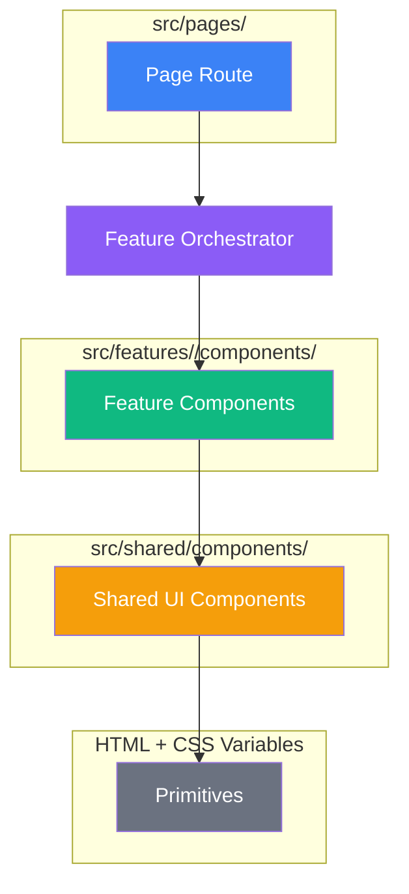

# System Architecture

> **Purpose:** High-level system design decisions, architectural patterns, and technology choices.  
> **For Implementation Details:** See feature-specific docs in `apps/backend/docs/` and `apps/frontend/src/features/*/docs/`.

## Table of Contents

- [Overview](#overview)
- [Monorepo Structure](#monorepo-structure)
- [Backend Architecture](#backend-architecture)
- [Frontend Architecture](#frontend-architecture)
- [Data Flow & Integration](#data-flow--integration)
- [Caching Strategy](#caching-strategy)
- [Authentication & Multi-User](#authentication--multi-user)
- [Quiz & Review System](#quiz--review-system)
- [External Services](#external-services)

---

## Overview

PinyinPal is a **full-stack Mandarin learning platform** built with:

- **Frontend**: React 19.1.0 + TypeScript + Vite (deployed to Vercel)
- **Backend**: Node.js + Express (deployed to Railway)
- **Database**: PostgreSQL with Prisma ORM (hosted on Neon)
- **Cache**: Redis (Upstash) for API response caching
- **External APIs**: Google Cloud TTS, Google Cloud Storage, Gemini AI

**Architecture Style:** Monorepo with npm workspaces, Modulith (Modular Monolith) on backend, Feature-Based Frontend

## Monorepo Structure

```
mandarin-vite-react-ts/
├── apps/
│   ├── frontend/          # React application (Vite + TypeScript)
│   └── backend/           # Express API (Node.js + Prisma)
├── packages/
│   ├── shared-types/      # Shared TypeScript interfaces
│   └── shared-constants/  # API routes, HSK levels, regex patterns
├── docs/                  # Architecture, guides, business requirements
├── content/              # Version-controlled content files (one JSON per entity)
│   ├── manifest.json
│   ├── characters/
│   ├── radicals/
│   ├── words/
│   ├── grammar/
│   └── chengyu/
└── terraform/             # Infrastructure as Code (GCS, IAM)
```

**See detailed structure:**

- Backend: [apps/backend/README.md](../apps/backend/README.md)
- Frontend: [apps/frontend/README.md](../apps/frontend/README.md)

## Backend Architecture

**Pattern:** Modulith (Modular Monolith) — modules pick their own internal pattern

**Layer Separation (Modular Monolith):**

- **App Layer** (`src/app/`): Entry point, DI composition root (`container.ts`), route registration (`routes.ts`)
- **Module Layer** (`src/modules/*/`): Per-domain modules containing `api/` (controllers/routes), `services/` or `use-cases/` (business logic), `repositories/` (data access), `types/` (typed interfaces)
  - Current modules: `auth`, `quiz`, `progression`, `review`, `foundations`, `radicals`, `health`, `mnemonics`
- **Shared Layer** (`src/shared/`): Cross-cutting — `infrastructure/` (external clients, cache, database, security), `middleware/`, `utils/`, `config/`

**Dependency Rule:** API → Services/Use-Cases → Repositories → Infrastructure, never reverse

**Key Design Decisions:**

1. **Single Express App** (dev + prod): Unified behavior, no dual-backend maintenance
2. **ESM Modules**: TypeScript source uses `.ts` files; the `.js` extension in import paths refers to compiled output (Node.js ESM requires file extensions in imports)
3. **Dependency Injection**: Constructor injection with direct instantiation at composition root
4. **Fail-Open Caching**: Redis failures never block requests (degrades to API calls)
5. **Repository Pattern**: All database access through repositories (abstracts Prisma)
6. **Types Directory**: Each module has `types/` with barrel re-exports; no `Record<string, unknown>` casts, no `as unknown as` double casts

**See detailed documentation:**

- Backend structure: [apps/backend/README.md](../apps/backend/README.md)
- Backend design decisions: [apps/backend/docs/design.md](../apps/backend/docs/design.md)
- API specification: [apps/backend/docs/api-spec.md](../apps/backend/docs/api-spec.md)
- Database schema: [apps/backend/DATABASE.md](../apps/backend/DATABASE.md)

## Frontend Architecture

**Pattern:** Feature-Based Organization with Context API state management

**Structure:**

- **Features** (`src/features/`): Self-contained modules
  - **Auth**: User authentication and session management (LoginForm, RegisterForm, AuthContext)
  - **Dashboard**: Learning statistics and activity overview (LeechWidget, leechService)
  - **Foundations**: Phase 1 learning path with Pinyin, Tones, Strokes, and Animations reference content
  - **Gamification**: Streaks, badges, XP progress, mystery box rewards
  - **Quiz**: Strategy-pattern-based quiz engine (`QuizStrategy` interface with `AudioToPinyinAndToneStrategy`) for audio-to-pinyin-and-tone assessment with progress tracking
  - **Review**: Strategy-driven SRS flip-card practice (`ReviewStrategy` interface with `PinyinReviewStrategy` + `ToneReviewStrategy`) for pinyin and tone identification with interval-doubling spaced repetition
  - **Vocabulary**: Flashcard-based vocabulary learning with spaced repetition
- **Pages** (`src/pages/`): Route-level page orchestrators
  - `pages/learn/`: Learn section pages (FoundationsPage with 4 sub-tabs, ContentPlaceholderPage for locked sections)
- **Router** (`src/router/`): React Router configuration
  - `LearnRoutes.tsx`: Phase-gated route definitions for the `/learn/*` section with redirects from deprecated routes
- **Shared Layer** (`src/shared/`): Cross-cutting concerns
  - **api/**: HTTP client (axiosClient, aliased as `services`)
  - **components/**: Reusable UI primitives (Button, Input, ToggleSwitch, etc.) + `CharacterDetailHub` shared portal overlay for character detail display
  - **config/**: Application configuration (API_CONFIG)
  - **constants/**: Path constants, tone maps
  - **hooks/**: Shared React hooks (usePhaseGate for phase-gating access, useReview for SRS review sessions, useCharacterHub for CharacterDetailHub overlay)
  - **layouts/**: AppLayout, LearnLayout (phase-gated route navigation with locked tab indicators)

### Component Hierarchy

The frontend follows a strict layering for component decomposition:



**Rules:**

1. **Pages** (`src/pages/`) — Route-level orchestrators, minimal JSX, delegates to features
2. **Feature components** (`src/features/<feature>/components/`) — Domain-specific compositions of shared UI
3. **Shared UI** (`src/shared/components/`) — Reusable primitives (Button, Input, Card patterns), never feature-specific
4. **Primitives** — Raw HTML elements styled with CSS variables from `globals.css`

**Before creating any component:**

1. Check `src/shared/components/index.tsx` — does a shared component already exist?
2. Check `DESIGN.md` — are there design tokens or component specs to follow?
3. Can the component be decomposed further? (If it does >2 things, split it)

**State Management:**

- **Pattern**: React Context + useReducer with split contexts and reducer composition
- **Provider Hierarchy**:
  ```
  BrowserRouter → AuthProvider (auth) → AppLayout → LearnLayout → ProgressProvider (quiz) + UserIdentityProvider (quiz)
  ```
- **Persistence**: Backend API (PostgreSQL) for progress, localStorage for device identity
- **Zustand Stores**: `hubStore` for CharacterDetailHub overlay state (isOpen, characterId, position)
- **Architecture**: Reducer composition with normalized state shape

**See detailed documentation:**

- Frontend structure: [apps/frontend/README.md](../apps/frontend/README.md)
- Feature modules: [apps/frontend/src/features/README.md](../apps/frontend/src/features/README.md)
- Frontend development guide: [Frontend Development Guide](./guides/setup/frontend-development.md)

#### Custom Data Fetching Hook

Custom data-fetching hooks (e.g., `useExamples`) with in-memory dedup and sessionStorage cache.

### Accessibility

**WCAG 2.1 AA compliance** for accessibility (ARIA labels, keyboard navigation, 44px+ touch targets, semantic HTML).

## Data Flow & Integration

**Content (static reference data) and User Data (dynamic progress) are separated at the storage layer and joined at query time.** See [Architecture Overview](../docs/architecture.md#content-data-flow) for the full design.

**Client → Server:**

```
Frontend Service → fetch(API_ROUTES.ttsAudio) → Vite Dev Proxy (dev) → Backend Controller
                                                 ↓
                                          Direct Request (prod)
```

**Backend Layers:**

```
Controller → Service (business logic) → Repository (database)
                ↓                            ↓
         External Client              Prisma ORM
         (Google TTS, Gemini)         (PostgreSQL)
                ↓
         Redis Cache (optional)
```

**Shared Constants:** `packages/shared-constants` ensures frontend/backend use identical API routes

**See detailed integration:**

- Vite proxy config: [Vite Setup Guide](./guides/setup/vite.md)
- Backend setup: [Backend Development Guide](./guides/setup/backend-development.md)

### Content Data Flow

Static content (characters, words, radicals, etc.) follows a separate path from dynamic user data:

```
┌───────────────────┐     ┌──────────────────┐     ┌─────────────────┐
│  content/*.json   │ ──► │  Seed Script /   │ ──► │  Prisma Content  │
│  (Git — versioned)│     │  Import Pipeline  │     │  Models (DB)     │
└───────────────────┘     └──────────────────┘     └────────┬────────┘
                                                            │
┌───────────────────┐     ┌──────────────────┐              │
│  review_log table │ ◄── │  CRUD Progress   │              │
│  (append-only)    │     │  API             │              │
└───────────────────┘     └──────────────────┘              │
                                                            ▼
                                                   ┌─────────────────┐
                                                   │  Read Model /   │
                                                   │  Query API      │
                                                   └─────────────────┘
```

**Key principles:**

- Content is authored in individual JSON files under `content/`, one per entity
- Entity relationships are stored in DB junction tables (CharacterRadical, WordCharacter, etc.)
- Dynamic user data uses CRUD with an append-only `review_log` side-effect table
- The Read Model pre-joins content + relationships + progress for query optimization

## Caching Strategy

**Pattern:** Cache-Aside with Fail-Open

**Cached Resources:**

- **TTS Audio**: 24-hour TTL, SHA256-keyed, Base64-encoded binary storage
- **AI Feedback**: 24-hour TTL, keyed per word+answer combination
- **Due Words**: 5-minute TTL per user
- **Quiz Attempts**: Results cached per user

**Performance:**

- **Hit Rate**: 75% (TTS) after warmup
- **Latency**: <20ms (cache hit) vs 1.5-5s (API call + generation)
- **Cost Savings**: >50% reduction in Google Cloud API costs

**Error Handling:**

- Redis failures return `null` (treated as cache miss)
- Requests always complete, using live API if cache unavailable
- Monitoring via `/api/v1/health` endpoint exposes hit/miss metrics

**See detailed implementation:**

- Redis caching guide: [Caching Patterns Guide](./guides/operations/caching-patterns.md)

## Authentication & Multi-User

**Pattern:** JWT with Refresh Token Rotation

**Token Strategy:**

- **Access Token**: 15-minute expiration, httpOnly cookie, used for API auth
- **Refresh Token**: 7-day expiration, stored in database, rotated on each refresh
- **Rotation**: Prevents replay attacks (each refresh issues new token, invalidates old)

**Password Security:**

- bcrypt hashing with cost factor 10
- Rate limiting: 5 login attempts per minute per IP

**Progress Isolation:**

- All progress records filtered by `userId` (from JWT claims)
- Foreign key constraints ensure referential integrity
- Unique constraint on `(userId, wordId)` prevents duplicates

**Cross-Device Sync:**

- Progress automatically synced to PostgreSQL via `/api/v1/progress/*` endpoints
- Frontend uses optimistic updates (immediate UI response, server reconciliation)

**See detailed implementation:**

- Auth system: [apps/backend/docs/api-spec.md](../apps/backend/docs/api-spec.md#authentication)
- Environment setup: [Environment Setup Guide](./guides/getting-started/environment-setup.md)

## Quiz & Review System

The platform has two distinct assessment systems. **Quiz** is a timed, auto-scored assessment for phase gating — strategy-pattern-based with `QuizAttempt` records. **Review** is a self-paced, self-rated spaced repetition system using SM-2 with active recall (prompt → type pinyin → select tone → self-rate retention).

### Phase Gating

Users progress through 4 learning phases (Blueprint → Core 300 → Network → Advanced Fluidity), each with gate quizzes to unlock the next. Phase gate state is stored server-side.

### Leech Detection

Items with repeated failures are flagged as "leeches" for targeted Pareto-based review.

### Backend Modules

- **Quiz module**: Strategy-based quiz engine, generates questions from content data, evaluates answers, manages attempt lifecycle
- **Progression module**: Handles phase gating, foundation progress tracking, quiz attempt coordination with pass threshold evaluation
- **Review module**: Builds review items from content files and SRS state, manages SM-2 scheduling

**See detailed documentation:**

- Strategy pattern implementation: [Strategy Pattern (Frontend)](./knowledge-base/frontend/strategy-pattern-frontend.md)
- Spaced repetition algorithm: [Spaced Repetition Algorithms](./knowledge-base/learning-theory/spaced-repetition-algorithms.md)
- API specification: [apps/backend/docs/api-spec.md](../apps/backend/docs/api-spec.md#progress-tracking-endpoints)

## External Services

**Google Cloud Platform:**

| Service             | Purpose                         | Client Location                                         | Configuration                |
| ------------------- | ------------------------------- | ------------------------------------------------------- | ---------------------------- |
| Text-to-Speech      | Audio generation for vocabulary | `src/shared/infrastructure/external/GoogleTTSClient.ts` | `GOOGLE_TTS_CREDENTIALS_RAW` |
| Cloud Storage (GCS) | Audio/file storage              | `src/shared/infrastructure/external/GCSClient.ts`       | `GCS_BUCKET_NAME`            |
| Gemini AI           | AI feedback & examples          | `src/shared/infrastructure/external/GeminiClient.ts`    | `GEMINI_API_CREDENTIALS_RAW` |

**Upstash Redis:**

- **Purpose**: API response caching (TTS, AI feedback, quiz sessions, due words)
- **Client**: `src/shared/infrastructure/cache/CacheService.ts`
- **Configuration**: `REDIS_URL` (from Upstash)

**Neon PostgreSQL:**

- **Purpose**: User accounts, progress tracking, authentication, gamification
- **Client**: Prisma ORM (`src/shared/infrastructure/database/client.ts`)
- **Configuration**: `DATABASE_URL`
- **Key Tables**: `users`, `progress`, `ReviewItem`, `QuizAttempt`, `QuizAttemptAnswer`, `StudyStreak`, `ContentItem`, `PhaseGate`

**Gamification System:**

Streak tracking with freeze currency, milestone badges, XP scoring, and mystery box rewards.

**AI Feedback System:**

Personalized error explanations for incorrect quiz answers via Gemini API, with Redis caching and timeout protection.

## Deployment Architecture

**Production Environment:**

| Component | Platform | Trigger          | Runtime                     |
| --------- | -------- | ---------------- | --------------------------- |
| Frontend  | Vercel   | Push to `main`   | Node.js 20 (Vite build)     |
| Backend   | Railway  | Push to `main`   | Node.js 20 (Express server) |
| Database  | Neon     | Manual migration | PostgreSQL 17               |
| Cache     | Upstash  | Always-on        | Redis 7                     |

**Development Environment:**

- **Frontend**: Vite dev server (port 5173) with HMR
- **Backend**: Express with `tsx watch` (port 3001) hot reload
- **Proxy**: Vite proxies `/api/*` to localhost:3001 for seamless development

**CI/CD:**

- Automatic deployments on push to `main`
- Backend runs Prisma migrations on release (`railway.toml`)
- Frontend builds via Vercel with automatic preview URLs

**See deployment guides:**

- Backend: [Backend Development Guide](./guides/setup/backend-development.md#deployment)
- Environment variables: [Environment Setup Guide](./guides/getting-started/environment-setup.md)

## Testing Strategy

**Backend (Vitest):**

- **Unit Tests**: Services, repositories, utilities (mocked dependencies)
- **Integration Tests**: Full API flows with test database (transactional isolation)
- **Coverage Target**: >80% for business logic

**Frontend (Jest + React Testing Library):**

- **Component Tests**: Render behavior, user interactions, accessibility
- **Hook Tests**: Custom hooks with `renderHook` utility
- **Integration Tests**: Feature flows with mocked backend

**See testing guides:** [Frontend Testing](./guides/testing/frontend.md) | [Backend Testing](./guides/testing/backend.md)

## Key Architecture Patterns

**Backend:**

- **Modulith Architecture**: Self-contained modules under src/modules/<name>/. Each module selects its internal pattern (Clean Architecture, CRUD, CQRS) based on business complexity. See backend-architecture.md for details.
- **Repository Pattern**: Abstracts Prisma ORM, enables testing with mocks
- **Dependency Injection**: Services receive dependencies via constructor/factory
- **Fail-Open Caching**: Redis failures degrade gracefully to API calls

📖 **Deep Dive:** [Backend Architecture Patterns](./knowledge-base/backend/backend-architecture.md) - Modulith Architecture, module patterns, CORS

**Frontend:**

- **Feature-Based**: Self-contained modules with own components/hooks/services
- **Split Context**: Separate state/dispatch contexts prevent unnecessary re-renders
- **Reducer Composition**: Domain sub-reducers combined into root reducer
- **Normalized State**: `itemsById` + `itemIds` for O(1) lookups, immutable updates

**Shared:**

- **Monorepo**: Shared types/constants ensure API contract consistency
- **Fail-Fast Validation**: Input validation at API boundary (controllers)
- **Structured Logging**: Consistent log format for debugging and monitoring

## Related Documentation

- **Implementation Details**: [docs/issue-implementation/](./issue-implementation/)
- **Business Requirements**: [docs/business-requirements/](./business-requirements/)
- **Development Guides**: [docs/guides/](./guides/)
- **Knowledge Base**: [docs/knowledge-base/](./knowledge-base/)

- **Code Conventions**: [Backend Conventions](./guides/conventions/backend.md)

---

**Last Updated:** July 3, 2026
