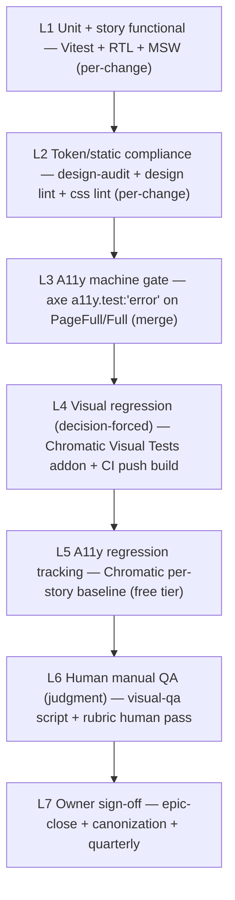

# PinyinPal UIUX Fundamentals

**Last Updated:** 2026-08-20
**Audience:** AI Coding Agents + Code Reviewer + Docs Writer
**Purpose:** the single committed reference for **what "good UI" means operationally** for this repo — the 12 fundamentals, the QA pyramid, the AI-slop forbiddance list, and the 2026-verified corrections to prior research. This is the distilled, committed source of record. See the companion resource index: `uiux-resources.md`.

> **Read-before-UI rule:** any agent writing UI must read this guide + `docs/guides/design/design-reasoning.md` + `DESIGN.md` + `component-registry.json` before composing. The `frontend-audit` skill (`frontend-audit/SKILL.md`) operationalizes this guide as a runnable audit procedure (Part 1 = the fundamentals + AI-slop).

---

## 1. The 12 UIUX Fundamentals (applied)

Each fundamental maps to: what it teaches → concrete PinyinPal application → who enforces it (machine rule or human rubric). The repo is **~70–90% conformant**; the work is closing enforcement gaps, not re-architecture. Enforcement references: `tools/design-audit.mjs` (machine), `docs/guides/design/design-quality-rubric.md` (human), `docs/guides/design/page-archetypes.md` (archetype contract).

| #   | Fundamental                                                        | Teaches                                                                                                                                                                                                                               | PinyinPal application                                                                                                                                                                                                                                                                      | Enforce                                                                                                                             |
| --- | ------------------------------------------------------------------ | ------------------------------------------------------------------------------------------------------------------------------------------------------------------------------------------------------------------------------------- | ------------------------------------------------------------------------------------------------------------------------------------------------------------------------------------------------------------------------------------------------------------------------------------------ | ----------------------------------------------------------------------------------------------------------------------------------- |
| 1   | **WCAG contrast (SC 1.4.3 / 1.4.11)**                              | Contrast is a _token-pair_ property: 4.5:1 body, 3:1 large (≥24px / ≥18.66px bold); dark mode = swap tokens, not components; placeholder text **is covered**; hairlines are decorative-exempt when the control has another identifier | `--text-*` ladder is role-mapped (primary/secondary ≥4.5:1 body; muted = large/decorative only; subtle/ghost = decorative-exempt-by-role, audited per usage) — **text-muted was bumped to ≥4.5:1 in the 2026-08-20 a11y sweep**; `--surface-border-subtle` (0.08) documented as decorative | `hardcoded-*` (errors) + axe gate (`test-storybook`, WCAG 2.2 `runOnly`) + `--size-touch: 28px` (SC 2.5.8)                          |
| 2   | **Typography discipline** (Refactoring UI + Polaris)               | ≤4–5 type sizes; weight/color over size; bold only for metrics; line-height & font-weight must be tokens                                                                                                                              | `--font-*` ladder consolidated + display tiers (`--font-3xl..6xl`) fluid via `clamp()` (ADR-009); `--lh-*` + `--fw-*` ladders; one shared typography role map in DESIGN.md                                                                                                                 | `hardcoded-font-size`, `hardcoded-line-height`, `hardcoded-font-weight` (errors); `display-tracking` advisory; `size-jump` advisory |
| 3   | **Semantic color roles** (IBM Carbon)                              | Roles over hex: Neutral / Brand / Feedback-Status; color carries meaning; pair ≠ color                                                                                                                                                | DESIGN.md §Color Roles taxonomy (Surface/Border/Text/Brand-Accent/Status/XP-Celebration); pinyin `--tone-*` only in sanctioned tone surfaces                                                                                                                                               | `tone-outside-sanctioned-surface` (error); `resting-amber-shadow` (error); `inline-style-magic-value` (error)                       |
| 4   | **Spacing & grids** (Atlassian + DesignSystems.com)                | 8pt grid; proximity = hierarchy; nesting tightens; space tokens never eyeballed                                                                                                                                                       | 8/12/16/24/32/40 scale + `gap-*` utilities; **nesting-tightens table** (outer `p-xl` → inner `p-lg` → card `p-md` → chip `p-xs`) in DESIGN.md §Spacing; 12px half-step = dense controls only                                                                                               | `hardcoded-spacing` (error); `uniform-gap`, `nesting-inversion` (advisories)                                                        |
| 5   | **Elevation & layering** (Vercel + Josh Comeau)                    | 3-step ladder; borders before shadows; hairline on elevated; stacking-context discipline                                                                                                                                              | `--shadow-elevated-1/2/3` neutral family; `--surface-border-subtle` hairline on every elevated surface; `--z-*` ladder (content < chrome < popover < modal < toast)                                                                                                                        | `slop-untokened-shadow`, `elevation-no-hairline`, `z-index-raw` (errors)                                                            |
| 6   | **Cognitive load** (NN/g: progressive disclosure, Hick's, Fitts's) | Minimize working memory; reveal on demand; default+focus; ≤3 nesting; bigger/closer targets                                                                                                                                           | Focus-First single-scroll shell; `--size-touch: 28px`; advanced options behind reveals; **hub-launcher size guard: cap ~8–9 launch targets per group** (Hick's law)                                                                                                                        | human rubric (per-page #17, #19) + `design-quality-rubric.md`                                                                       |
| 7   | **Layout physics** (Josh Comeau + Tailwind ref)                    | `min-w-0`; `isolate`/stacking contexts; overflow knobs                                                                                                                                                                                | Single-scroll shell (`100dvh`/`overflow:hidden`/`overscroll-behavior`/`min-height:0`); scroll-chain rule + layout-breakage playbook in `frontend-css-styling.instructions.md`                                                                                                              | responsive gate + human rubric #15 + `z-index-raw`                                                                                  |
| 8   | **Quality bar** (Linear + Vercel)                                  | One North Star; quality is a system property; roll out against it                                                                                                                                                                     | Golden Templates: `ReviewView` (focus-task) + `DashboardPage` (hub-launcher); **canonization protocol** (8 evidence gates) recorded in `verification-artifacts/northstar-canonization-review.md`; consistency snapshot at epic close                                                       | process gate (#13) + `visual-qa.md` script                                                                                          |
| 9   | **Deep hierarchy craft** (Refactoring UI)                          | Squint test; weight/color over size; depth sparingly; generous padding > borders                                                                                                                                                      | Squint-test step (top 3 visible elements = intended hierarchy); **depth budget ≤2–3 competing elevated surfaces per viewport**                                                                                                                                                             | human rubric #18 + `size-jump` advisory                                                                                             |
| 10  | **Data-dense enterprise** (Carbon + Polaris Viz)                   | Dense scan-friendly tables; tabular numerals; status via roles not saturation                                                                                                                                                         | **Deferred to epics 36/37** (speaking/HSK timed); pre-write the browse-index dense spec (row-height tokens, `tabular-nums` utility, status via `--success/error/warning/info` only)                                                                                                        | tokens + utility when the first dense surface ships                                                                                 |
| 11  | **Composition & portals/focus** (DesignSystems.com + Radix)        | Portal + focus trap for nested UI; compose via sub-parts, never parent-injected styles                                                                                                                                                | **Deferred to epic 31** (conversation panel): adopt Radix primitives for Modal/Dropdown when popover-in-dialog nesting appears; until then enforce the a11y gate on hand-rolled primitives                                                                                                 | a11y gate (keyboard/focus/trap) + `frontend-component-architecture` (no parent-injected styles)                                     |
| 12  | **Tailwind docs**                                                  | Predefined system over magic numbers; layout knobs                                                                                                                                                                                    | **Reference-only, no adoption** (no-Tailwind repo); its rationale = token freeze + `inline-style-magic-value`; its layout sections = source for #7's playbook                                                                                                                              | — (reference)                                                                                                                       |

### The two genuinely deferred items

- **#10 data density** — a spec written ahead of the surface (so epic 36/37 doesn't invent dense-list patterns ad hoc). Not needed for current surfaces.
- **#11 composition/portals** — a dependency decision (extract `useFocusTrap` vs adopt Radix at epic 31) that must be settled before the conversation panel is specced.

---

## 2. The 7-Layer QA Pyramid

Every UI surface is "done" when all its layers have a recorded pass. Cost-shaped to solo-dev reality — **no new gate numbers** (everything strengthens gate #7/#9/#13).

| Layer | Tool                                                                               | Cadence                               | Who                     | Catches                                                                   |
| ----- | ---------------------------------------------------------------------------------- | ------------------------------------- | ----------------------- | ------------------------------------------------------------------------- |
| L1    | Vitest 4 + RTL + `test-storybook` + MSW                                            | per-change                            | FE                      | behavior, logic, states, render errors, API contracts                     |
| L2    | `design-audit` + `@google/design.md lint` + stylelint                              | per-change                            | FE+DW                   | token violations, slop, magic values, color-role leaks, elevation/z-index |
| L3    | `addon-a11y` `a11y.test:'error'` + `runOnly` wcag22a/aa                            | merge                                 | FE                      | contrast, ARIA, labels, keyboard/focus, target-size (~57% of WCAG)        |
| L4    | Chromatic (local Visual Tests addon + CI `push` build; TurboSnap after 10 builds)  | every PR                              | FE run / Owner accept   | layout drift, overflow, elevation/hairline, spacing rhythm, golden parity |
| L5    | Chromatic a11y per-story baseline                                                  | every PR                              | machine                 | **new** a11y violations only (debt separated)                             |
| L6    | `docs/guides/testing/visual-qa.md` per-surface script + rubric human pass + squint | epic-close + quarterly                | DW (runs) + CR (review) | judgment: "is it right/beautiful", hierarchy, contrast appearance, parity |
| L7    | recorded preview + sign-off line                                                   | epic-close + canonization + quarterly | Owner                   | "this is the accepted standard" decision                                  |

### Reliability principles (why this is reliable, not vibes)

1. **Decision-forced** — the accept/deny baseline requires a per-diff decision instead of trusting you to remember to look.
2. **Regression-based gates** — a11y = no-new-violations (`'todo'` markers → Chromatic baseline); visual = diff-vs-accepted-baseline; design-audit = baseline-shrink guard.
3. **Recorded evidence trail** — every layer writes a durable artifact (logs → `verification-artifacts/` summaries; Chromatic accept history; canonization file).
4. **Forced human gate at the right cadence** — routine = per-PR accept; judgment = epic-close + quarterly; acceptance = Owner sign-off.
5. **Explicit Definition of Done per surface** — 8-gate canonization + rubric DoD + per-surface QA script.
6. **Cost-shaped to solo reality** — free tier, already-installed tools, TurboSnap to cap cost, story-every-state, no new gate numbers.

---

## 3. Consolidated AI-Slop Checklist

The canonical forbiddance list — consolidated from `tools/design-audit.mjs`, DESIGN.md (Global Motion Rule, Amber Restriction, emoji rule, gradient whitelist), and `design-reasoning.md` §1/§6. Run every item on any new/edited UI (the `frontend-audit` skill automates this in Part 1B).

| #   | Check                                                                                 | Enforcement                                                         |
| --- | ------------------------------------------------------------------------------------- | ------------------------------------------------------------------- |
| 1   | Gradient only on sanctioned surfaces (whitelist) — no gradient backgrounds outside it | `slop-gradient` (error)                                             |
| 2   | No glassmorphism / backdrop-filter                                                    | `slop-backdrop-filter` (error)                                      |
| 3   | No glow/glass blur                                                                    | `slop-blur` (error)                                                 |
| 4   | Shadows tokenized (`--shadow-elevated-*` / amber family per ladder)                   | `slop-untokened-shadow` (error)                                     |
| 5   | Emoji only where the `Icon` component doesn't cover the surface; banned once covered  | `slop-emoji` (advisory) + human                                     |
| 6   | Resting amber shadow forbidden — hover/XP only (Amber Restriction A.3)                | `resting-amber-shadow` (error)                                      |
| 7   | No decorative animation/transition/transform in feature CSS (Global Motion Rule)      | `transition-token-only` (advisory) + human                          |
| 8   | ≤1 filled saturated element per viewport (all hues, not just amber)                   | `saturated-fill-overflow` (advisory) + rubric one-CLA               |
| 9   | Display headings carry `tracking-tight`                                               | `display-tracking` (advisory)                                       |
| 10  | No confetti/particles/floating orbs/glow gradients (AI-Native UI / playful)           | human (`design-reasoning.md` §1 "what it's NOT")                    |
| 11  | Microcopy: action verbs, empty states give a next step, no placeholder slop           | human (rubric #12)                                                  |
| 12  | No hardcoded color/spacing/font-size/line-height/font-weight/radius/z-index           | `hardcoded-*` + `z-index-raw` + `inline-style-magic-value` (errors) |

---

## 4. 2026 Fact-Check Corrections (verified against live sources)

These correct earlier research. Do not reintroduce the stale claims.

1. **Placeholder-text contrast is NOT exempt.** WCAG 2.2 SC 1.4.3 explicitly covers placeholder text — the earlier plan to reclassify `text-subtle`/`text-ghost` as "placeholder-exempt" was wrong. Bump tokens for information-bearing text; only true decorative roles are exempt.
2. **Chromatic CI must trigger on `push`, not `pull_request`.** TurboSnap is incompatible with the `pull_request` trigger, and unlocks only **after 10 successful builds** (start without `--only-changed`). CLI 10.0+.
3. **Chromatic free tier = 5,000 _billed_ snapshots/mo** (~25k TurboSnap-equivalents); a11y **tests** included in Free, a11y **reports/dashboard** are Starter+.
4. **Use Lucide, not hand-drawn SVGs.** 2026 norm for a solo dev is a library (Lucide, ISC) wrapped in the repo's own `Icon` component — the earlier "hand-draw 20–30 custom SVGs" plan is superseded (ADR-010).
5. **Cite Material 3, not M2** — m2.material.io is deprecated (2026 banner).
6. **WCAG 2.2 needs explicit `runOnly`** — default axe rulesets are WCAG 2.0/2.1 A/AA + best practices; add `wcag22a`/`wcag22aa`.
7. **Use `parameters.a11y.test:'todo'` for a11y debt** (Storybook's first-class marker), not a custom baseline file. The `used-but-undefined-class` baseline stays for CSS only.
8. **Playwright fallback is well-supported** — Vitest 4 has first-class browser visual-regression; `@vitest/browser-playwright ^4.1.9` is installed. Still env-sensitive (goldens must match the compare environment).

### Bonus facts that shape the design

- The **Visual Tests addon** ships inside `@chromatic-com/storybook ^5.2.1` (already installed + registered) — local accept/deny is available now.
- WCAG 2.2 target-size (SC 2.5.8, 24px) maps to the repo's `--size-touch: 28px`.
- Hairlines (`--surface-border-subtle` 0.08) are legitimately decorative-exempt per SC 1.4.11 "Boundaries" — document, don't bump.

---

## 5. Enforcement Map (fundamental → rule/gate)

| Enforced by                               | Fundamentals                                    |
| ----------------------------------------- | ----------------------------------------------- |
| `design-audit` errors                     | #1, #2, #3, #4, #5, #7, #12 (+ AI-slop 1–9, 12) |
| axe gate (L3, `test-storybook`)           | #1, #6, #11                                     |
| Chromatic (L4/L5)                         | #5, #8, #9, #4                                  |
| Human rubric (`design-quality-rubric.md`) | #6, #8, #9, #10                                 |
| `visual-qa.md` script (L6)                | #8, #9 (epic-close cadence)                     |
| Canonization protocol (gate 8)            | #8                                              |

---

## Cross-references

- `docs/guides/design/design-reasoning.md` — ADR-007..010 (North-Star identity, Text-Role Contrast Tiers, Fluid Display Type Scale, Vibrancy Amplification), style identity, anti-patterns §6
- `docs/guides/design/design-quality-rubric.md` — the scored per-page (19) + per-component (8) rubric
- `docs/guides/design/page-archetypes.md` — the 8 archetypes + Golden Templates
- `docs/guides/design/uiux-resources.md` — the 30-resource study-card index (source provenance)
- `docs/guides/testing/visual-qa.md` — the per-surface human QA procedure
- `DESIGN.md` — tokens, component specs, Elevation Usage Ladder, Global Motion Rule
- `.github/decision-log.json` — the 12 UIUX-Q decisions + ADR-007..010 records
- `.github/skills/frontend-audit/SKILL.md` — the runnable audit procedure built on this guide (Part 1 = fundamentals + AI-slop)
