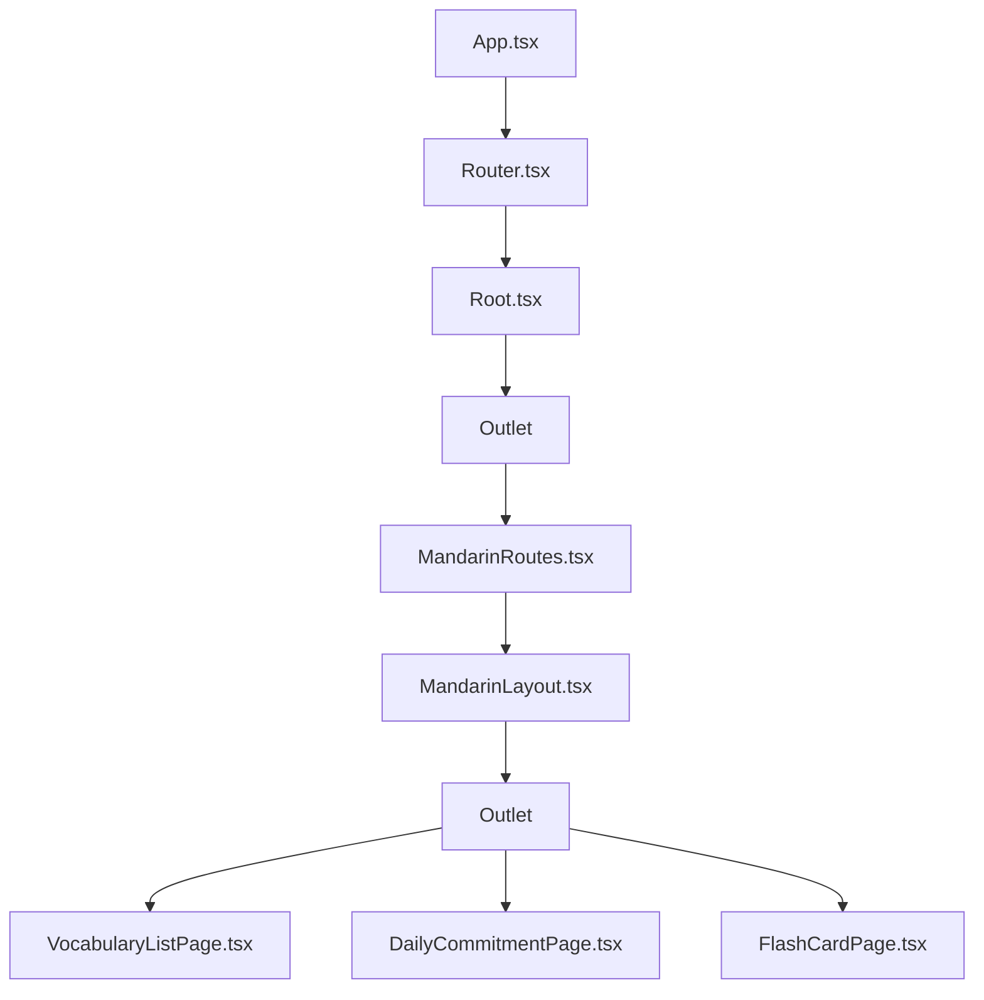

# Document Streamlining Guide

This guide provides strategies and templates for creating more concise, visual, and effective documentation.

## Executive Summary Template

Start each significant document with an executive summary:

```markdown
## 📌 Executive Summary

**Goal:** [One-sentence goal statement]

**Key Points:**

- [Point 1 - most critical insight]
- [Point 2 - second most important point]
- [Point 3 - third most important point]
- [Point 4 - fourth most important point]
- [Point 5 - fifth most important point]

**Status:** [Completed | In Progress | Planning]
```

Example:

```markdown
## 📌 Executive Summary

**Goal:** Refactor the Mandarin feature to use proper nested routing instead of state-driven navigation.

**Key Points:**

- Improves direct URL access to subpages
- Enables browser history integration (back/forward buttons)
- Separates components into dedicated page components
- Maintains context-based state management from Epic 3
- Updates all navigation to use React Router

**Status:** Completed
```

## Visual Diagram Templates

### 1. Component Relationship Diagram

Use Mermaid.js for component relationship diagrams:

````markdown


````

### 2. Data Flow Diagram

```mermaid
graph LR
    User[User Input] --> Action[Action Creator]
    Action --> Context[Context Provider]
    Context --> State[State]
    State --> Components[Components]
    Components --> User
````

### 3. State Transition Diagram

```mermaid
stateDiagram-v2
    [*] --> VocabularyList
    VocabularyList --> DailyCommitment: Select list
    DailyCommitment --> SectionConfirm: Set commitment
    SectionConfirm --> SectionSelect: Confirm
    SectionSelect --> FlashCards: Select section
    FlashCards --> FlashCards: Continue
    FlashCards --> SectionSelect: Complete section
```

## Collapsible Sections Template

For lengthy details, use collapsible sections:

````
<details>
  <summary><strong>Detailed Implementation Notes</strong></summary>

  [Detailed content goes here...]

  ```tsx
  // Specific code examples
````

</details>
```

Example usage:

````
## Implementation Approach

Our approach focuses on clean separation of concerns.

<details>
  <summary><strong>Technical Details</strong></summary>

  The implementation uses React Router v6's nested routes with layouts that leverage Outlet components. Context providers wrap the routes to ensure state is available throughout the feature.

  ```tsx
  <Route element={<MandarinLayout />}>
    <Route index element={<VocabularyListPage />} />
    <Route path="vocabulary-list" element={<VocabularyListPage />} />
    <Route path="flashcards/:sectionId" element={<FlashCardPage />} />
  </Route>
````

</details>
```
````

</details>
```

## Information Hierarchies

Organize content with clear hierarchies:

1. **Executive Summary** - 5 key points
2. **Core Information** - Essential details every reader needs
3. **Technical Details** - Relevant for implementers (in collapsible sections)
4. **Reference Information** - Links to related docs and resources

## Document Structure Template

For epic documentation:

```markdown
# Epic X: Title

## 📌 Executive Summary

[As described above]

## 🎯 Objectives

- Clear bullet points describing goals

## 🏗️ Architecture

[Visual diagram of components/structure]

## 📝 Key Implementation Details

- Focus on the most important technical aspects
- Keep this section brief and visual

<details>
  <summary><strong>Detailed Implementation</strong></summary>
  [In-depth technical details]
</details>

## 🔄 Data Flow

[Visual diagram of data flow]

## 📊 Results & Benefits

- Brief bullet points of outcomes

## 📚 Resources

- Links to related documents
- References to key components
```

## Decision Tables

Use tables for comparing options or documenting decisions:

```markdown
| Approach               | Pros                         | Cons                               | Decision |
| ---------------------- | ---------------------------- | ---------------------------------- | -------- |
| State-based navigation | Simple to implement          | No URL support, no browser history | Rejected |
| React Router           | URL support, browser history | More complex                       | Selected |
| Custom routing         | Full control                 | Maintenance burden                 | Rejected |
```

## Before/After Comparisons

Show the impact of changes with before/after examples:

````
### Before Refactoring
```tsx
function Mandarin() {
  const [currentPage, setCurrentPage] = useState("vocabularyList");

  // Render different components based on state
  return (
    <div>
      {currentPage === "vocabularyList" && <VocabularyList />}
      {currentPage === "flashcards" && <FlashCards />}
    </div>
  );
}
````

### After Refactoring

```tsx
function MandarinRoutes() {
  return (
    <Routes>
      <Route element={<MandarinLayout />}>
        <Route path="vocabulary-list" element={<VocabularyListPage />} />
        <Route path="flashcards/:sectionId" element={<FlashCardPage />} />
      </Route>
    </Routes>
  );
}
```

## Tips for Document Brevity

1. **Eliminate redundancy** - Say it once, reference it elsewhere
2. **Use visual elements** - A diagram can replace paragraphs of text
3. **Progressive disclosure** - Start with key information, hide details in collapsible sections
4. **Link don't repeat** - Reference existing docs rather than duplicating content
5. **Focus on decisions** - Explain why, not just how or what

## Applying This Guide

1. Review existing documentation for length and clarity
2. Add executive summaries to all epic and complex story documents
3. Convert text-heavy explanations to visual diagrams
4. Use collapsible sections for detailed implementation notes
5. Update templates to incorporate these patterns

## Resources

- [Mermaid.js Documentation](https://mermaid-js.github.io/mermaid/#/)
- [Markdown Guide](https://www.markdownguide.org/)
- [Technical Writing Best Practices](https://developers.google.com/tech-writing)

```

```
