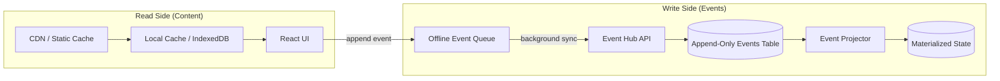

# Local-First CQRS for Language Learning

**Category:** Infrastructure  
**Last Updated:** June 26, 2026

---

## Why

Language learning apps face a unique challenge: they must serve rich static content (characters, words, radicals, example sentences) while recording frequent, low-latency user actions (flashcard reviews, quiz answers, streak updates). A traditional CRUD architecture — where every review waits for a network round-trip to update a database row — creates lag, fails offline, and loses the historical data needed for analytics.

Separating the **read side** (content queries, cache-friendly) from the **write side** (event recording, append-only) gives instant UI, offline resilience, and rich analytics from a single event history.

---

## Use Case

Any learning app where:

- Static content changes infrequently but must be served instantly
- User actions (reviews, quiz answers) happen frequently and must feel instantaneous
- Offline support is required (commuters, travelers, areas with poor connectivity)
- Historical event data is needed for analytics (FSRS parameter tuning, error analysis, progress trends)

---

## Key Concepts

### The CQRS Separation



### Read Side: Static Content

The read side serves pre-authored content that rarely changes. It is:

- **Cacheable** — content JSON files can be served via CDN and cached in IndexedDB
- **Version-bound** — clients check a manifest for the latest version and download only deltas
- **Instant** — no network dependency for rendering flashcards, character details, or word lookups

### Write Side: Append-Only Events

The write side records every user action as an immutable event:

```json
{
  "event_id": "evt_9981",
  "type": "ITEM_REVIEWED",
  "payload": {
    "item_id": "c_3401",
    "rating": 4,
    "speed_ms": 850
  },
  "timestamp": 1782240000
}
```

Events are:

- **Append-only** — never mutated or deleted
- **Immutable** — the historical record is preserved forever
- **Ordered** — timestamps enable replay and state reconstruction

### Offline Event Queue

When the user reviews a flashcard offline:

1. Append event to local queue (IndexedDB or JSON file) — **<1ms**
2. Update local optimistic state immediately
3. Return success to UI — **no loading spinner**
4. When connectivity restores: batch-send all queued events to server
5. Server replays events, updates materialized state, returns sync confirmation

### Why This Matters for Learning Apps

| Scenario                                    | CRUD Anti-Pattern                         | CQRS Pattern                             |
| ------------------------------------------- | ----------------------------------------- | ---------------------------------------- |
| Review flashcard                            | POST → wait for DB write → 200ms+ lag     | Append local event → instant UI          |
| Offline subway commute                      | ❌ "No internet connection" error         | ✅ Reviews queued, syncs later           |
| Analytics query                             | ❌ No historical data (only latest state) | ✅ Full event history for FSRS training  |
| Typo fix in content                         | ❌ May corrupt progress references        | ✅ Events reference content_id + version |
| New feature (e.g., tone accuracy dashboard) | ❌ Need new DB columns                    | ✅ Query existing event history          |

---

## DO/DON'T Examples

### DO: Append events and update local state optimistically

```typescript
// GOOD — record event, update UI, sync later
async function recordReview(event: ReviewEvent): Promise<void> {
  await offlineQueue.append(event); // <1ms, no network
  localState.updateDueCards(event); // immediate UI update
  backgroundSync.schedule(); // sync when online
}
```

### DON'T: Wait for server confirmation before updating UI

```typescript
// BAD — user waits for network round-trip
async function recordReview(event: ReviewEvent): Promise<void> {
  await api.post("/v1/reviews", event); // 200ms+ if online, fails if offline
  localState.updateDueCards(event); // too late, user already waiting
}
```

### DO: Use content_id + content_version in events

```typescript
// GOOD — events fully describe what was reviewed, at what content state
const event = {
  type: "card_reviewed",
  payload: {
    content_id: "ch_0342",
    content_version: 5, // which version of the content was reviewed
    rating: 4,
  },
};
```

### DON'T: Store event payloads in relational columns

```typescript
// BAD — every new metric requires a schema migration
// Adding speed_ms, phase, or quiz_type means ALTER TABLE
```

### DO: Use a projector to compute materialized state from events

```typescript
// GOOD — state is derived from events, rebuildable at any time
function projectReviewEvent(state: CharacterProgress, event: ReviewEvent): CharacterProgress {
  return {
    ...state,
    interval: computeNextInterval(state.interval, event.rating),
    dueDate: addDays(new Date(), computeNextInterval(state.interval, event.rating)),
    reviews: state.reviews + 1,
  };
}
```

### DON'T: Store derived state as the source of truth

```typescript
// BAD — mutating progress directly loses the historical record
await db.characterProgress.update({
  where: { userId_charId: { userId, characterId } },
  data: { interval: newInterval, dueDate: newDueDate },
});
// Now you can't answer: "What did the user rate this card last time?"
```

---

## Tradeoffs

| Tradeoff                        | Consideration                                                                            |
| ------------------------------- | ---------------------------------------------------------------------------------------- |
| **Event storage cost**          | ~100 bytes/event. 50 reviews/day × 1000 users × 365 days = ~18MB/year. Trivial.          |
| **Projection lag**              | Materialized state is eventually consistent. For learning apps, <1s delay is acceptable. |
| **Offline conflict resolution** | Server timestamp wins for rare conflicts (user reviews same card on two devices).        |
| **Initial complexity**          | Requires event queue, sync protocol, and projector — more code than direct CRUD.         |

---

## Cross-References

- [Pre-Adaptation Static/Dynamic Separation](../backend/pre-adaptation-static-dynamic-separation.md) — The 5 rules that make this architecture possible today
- [Caching Strategies](./integration-caching.md) — Cache-aside pattern for the read side
- [Spaced Repetition Algorithms](../learning-theory/spaced-repetition-algorithms.md) — The SM-2/FSRS logic that the projector computes
- [Modeling Chinese as a Knowledge Graph](../learning-theory/modeling-chinese-knowledge-graph.md) — How graph queries can be flattened for the read cache
