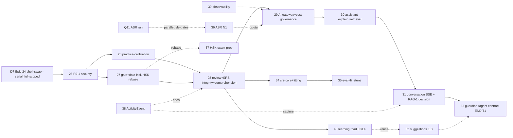

# Epic Plan 25–40 — Re-Sliced (Calibration + AI Roadmap)

**Status:** ✅ RATIFIED — owner-approved 2026-08-17; **D7 serial sequencing re-ratified 2026-08-21 (D10)** — full-scoped Epic 24 runs first to completion; epics 25–28 land on NestJS after

**Last Updated:** 2026-08-21

**Provenance:** Built from the Architect re-slice (epics 25–40, all blocks + sequencing + re-slice notes) + the OI-1…OI-10 decision record; anchored to the RATIFIED business model BM-1 + tech-mapping D1/D7 DECIDED. Promoted to `docs/planning/` as the committed source of record (2026-08-17); BRs for epics 25+ build against this plan. **2026-08-21 re-ratification:** the D7 execution model is **serial**, not parallel-with-25–28 (decision-log **D10**); this supersedes the earlier "D7 ∥ 25–28, P0-1 first gate" framing (see the Context Summary reversal note + OI-1).

> ⚠️ **Re-ratification (2026-08-21, D10):** the earlier **"D7 shell-swap parallel with 25–28; P0-1 first gate"** constraints are deliberately **reversed** — **full-scoped serial Epic 24 runs FIRST to completion (15 stories, including the P0-1 security stopgap as 24-1); epics 25–28 START AFTER, all on NestJS.** Every former B-gate becomes A (absorb) or C (declare). This is an owner decision (owner re-ratification), not an editorial change.

---

## Context Summary

Reviewed: `docs/business/business-model.md` (ratified L-series, P11-AMEND, Appendix B) plus the calibrated guest-access, tech-mapping, and production-readiness working specs. Locked constraints honored unchanged: D1=NestJS 11, **D7=full-scoped serial Epic 24 first; 25–28 after, on NestJS** (29/30/31 land on NestJS) — ⚠️ deliberate owner re-ratification 2026-08-21 (D10) **reversing** the earlier "D7=shell-swap parallel with 25–28" + "P0-1 first gate" framing; **P0-1 absorbed into Epic 24 (24-1 stopgap)** instead of being epic-25's gate 1; P0-2 re-based as data prerequisite, 4 satellite carve-outs, business-deferred items kept out of scope.

## Re-Slicing Principles

1. **Epic numbers 25–40 are kept stable** — every decision-log anchor (`epic-25` P0-1, `epic-27` rebase, `epic-29` quota, `epic-31` conversation demo-quota, `epic-36` Q11-gated, `epic-37` after rebase, `epic-38` ActivityEvent, `epic-39` observability, `epic-40` L3/L4) stays valid. No renumbering, no merges.
2. **Re-slicing is done by re-bounding** — sub-scope moved between epics so each has a single closable purpose with explicit non-goals.
3. **The four widest epics (26, 27, 29, 33) are structured as two gated milestones each** — each milestone is a closable horizontal/vertical slice with its own AC set, so no epic feels like a mega-epic. Each is flagged with a _recommended split_ if it grows.
4. **UI is folded into its epic** as `UI: <what> — design spec TBD`. Backend-only epics say `UI: none` explicitly.
5. **ACs are testable and gate-aligned** — backend → integration test / endpoint contract; frontend → component/story or e2e; close criteria reference the repo's two-tier gates (Tier 1 per-change, Tier 2 at story/epic-close).

---

## Epic 25 — Secure Guest Identity & Route Gating _(Phase A)_

**Goal:** Make guest mode safe and correct — close the P0-1 cross-tenant SRS leak, land the guest identity shape (`isGuest` + `currentPhase:1`) in lockstep across backend and shell, gate every Learn route, and verify the two `optionalAuth` TTS surfaces are guest-governed.

**Boundary — IN:**

- **P0-1**: repository-level rejection of `undefined` userId on all `optionalAuth` SRS reads; review-GET guest guard (guest → session-local scope, never another user's rows).
- **Guest identity lockstep**: `createGuestPhaseGate → { currentPhase:1, isGuest:true }`; `AppLayout :4 → isGuest` removal; `getGates`/`getPhaseGate` guest branch unified (single source, one cache key, cleared on auth change — kills the §7.2 staleness); `ProgressionController.getGates` guest branch.
- **Route gates**: data-driven `LEARN_REQUIRED_PHASE` for all 6 Learn routes, closing the radicals/phonetic-clusters URL bypass.
- **Guest cost-surface verification**: the two `optionalAuth` TTS surfaces (`POST /v1/tts`, passage-audio) resolved as **cache-first-free for guests**; generated-audio quota mechanics documented as epic-29's.

**Boundary — NON-GOALS (OUT):** guest CTA/copy + value-moment upgrade prompts → epic-26 (pattern reused in 31/36); demo-quota server counters + circuit breaker + cross-feature budget → epic-29; generated-TTS quota mechanics → epic-29; practice-lane calibration/quiz formats/review wiring → 26/28; soft-readiness gate→recommendation UI → epic-40.

**Rough AC (6):**

1. BE integration: every `optionalAuth` SRS read with an anonymous caller returns 401 (or guest-scoped empty) — the repository rejects `userId === undefined` (no Prisma ignore-undefined path). **[P0-1]**
2. BE contract: `createGuestPhaseGate` returns `{ currentPhase: 1, isGuest: true }`; `getGates` and `getPhaseGate` agree for the same guest identity under one cache key (evicted on auth change).
3. FE e2e: with `isGuest` true, the shell renders the Phase-1 shape; direct navigation to any higher-phase Learn route shows the gate screen (radicals/phonetic-clusters bypass closed).
4. BE contract: `POST /v1/tts` + passage-audio verified guest-safe — cache-first reads return without a billable generation; any generated path is explicitly counter-gated (mechanics in 29).
5. FE regression: existing guest flows (browse, quiz attempt, review view) still function after the gate change.
6. Release gates green (full suite); new P0-1 security tests committed.

**UI scope:** `UI: guest-mode shell (isGuest badge/banner in AppLayout) + route-gate fallback screen (locked-surface placeholder) — design spec TBD`. _(CTA/copy deliberately not here — see 26.)_

**Dependencies:** none (first post-24 epic). **Lands on NestJS after Epic 24 completes (serial)**; P0-1 + guest-auth semantics are absorbed into Epic 24 (24-1 stopgap + 24-7 identity + 24-11 structural), so epic-25's residual = FE route gating + guest-shell UI + TTS-surface verification on Nest.

**Close criteria:** story BRs + impls (25-1 P0-1 guard, 25-2 guest-gate lockstep, 25-3 route gates + TTS verification) with Status/Last-Update + all ACs boxed; verification artifact `verification-artifacts/epic-25-*`; Tier 1 + Tier 2 gates (backend type-check, full suite, backend-audit skill).

---

## Epic 26 — Practice Calibration: Engine Fixes + Guest Lane + Phase-B Formats _(Phase B, part 1)_

**Goal:** Make the Practices lane correct, guest-accessible, and 10-format complete — fixing `PHASE_CONFIGS[3]`/aggregation, shipping the guest practice lane with value-moment CTAs, and adding Q6/Q7/Q9/Q10 on curated content.

**Boundary — IN:**

- **M1 — engine + guest lane:** `PHASE_CONFIGS[3]` added; key-4 dedupe (duplicate-of-2 removed); `useQuizCard` aggregates quizzes for `p ≤ currentPhase` (not current-only); `QuizCard` no longer mislabels the lowest-phase quiz as current; `MULTIPLE_CHOICE_STRATEGIES`/`QUIZ_LABELS` coverage for the format set; guest practice lane (session-local, per L1), guest CTA/copy + post-quiz "register to lift the demo quota" value-moment (client UX only; server enforcement in 29).
- **M2 — Phase-B format expansion:** Q6 cloze, Q7 sentence-building, Q9 listening-dictation, Q10 tone-judgment (separate Phase-1 format — P3) on curated content banks derived from the word + graded-reader corpus (P5); Q8 comprehension **authoring rule codified** (≥1 typed answer — P2), applied when Q8 ships in epic-28.

**Boundary — NON-GOALS (OUT):** quiz-failure→review wiring, interleaving, guest session-local review → epic-28; Q8 comprehension format + P3→4 gate → epic-28; demo-quota server counters → 29; `srs-core`/ts-fsrs → 34.

**Rough AC (6):**

1. FE contract: Practices renders quizzes for all phases ≤ current (`PHASE_CONFIGS[3]` present; no duplicate key-4).
2. FE e2e: guest completes a Phase-1 quiz; results are session-local; register CTA appears at a value moment per L1 — no server row written for the guest attempt.
3. FE story/component: each new format (Q6/Q7/Q9/Q10) renders and scores on the curated bank; Q10 is a distinct Phase-1 format (not a sub-mode of `audio-to-tone`).
4. BE contract: quiz submit/complete accepts the 4 new `StrategyType`s and persists `QuizAttempt`/`QuizAttemptAnswer` for registered users.
5. Content: curated banks pass seed verification + manifest counts; Q8 typed-answer authoring rule documented (P2).
6. Regression: existing quiz flows pass the full suite after engine fixes.

**UI scope:** `UI: guest practice lane + post-quiz value-moment CTA + 4 new quiz-format surfaces (Q6 cloze, Q7 sentence-building, Q9 listening-dictation, Q10 tone-judgment) — design spec TBD`.

**Dependencies:** needs 25. **Lands after Epic 24 (serial)** — 24-13 ports the correct backend quiz engine shape (M1 backend); the FE quiz-engine fixes stay in this epic (C-declared by 24-13). Parallel: 27, 38, 39.

**Close criteria:** story docs + impls; Storybook-first UI design per protocol (stories for each new format); Tier 1 + Tier 2 (story tests, design audit, frontend-audit); verification artifact. **Recommended split:** promote M2 (formats) to its own epic if it grows — it is self-contained (strategies + curated banks + stories).

---

## Epic 27 — Gate & Data Calibration incl. HSK 2025-Rebase _(Phase C)_

**Goal:** Calibrate the gate/threshold + readiness data, fix the pinyin phoneme/teaching layer, define the radical expansion path, and land the HSK 2025-rebase data program without regressing the P0s/guards.

**Boundary — IN:**

- **M1 — thresholds + phonemes + radicals:** P1 90%/10Q into `GATE_THRESHOLDS` (documented calibration, D8); 500-char readiness data path; pinyin phoneme layer 18+32 → 21+38 = 59 (+c/s/z, +er/üan/ün/ueng/ê/apical-i; drop `io`); radical 20→50→100 content-validated expansion path + Core-300 derived top-300 by `frequencyRank` (add `@@index([frequencyRank])` on `Character`; supplementary, not mandatory — D15/V5).
- **M2 — HSK 2025-rebase (override-2):** `hsk-word-counts.js` band-end mis-sum fix (17,034 bug); `HSK_SYLLABUS` flag; 10,943 word reconciliation (149 multi-level tags preserved via `WordHskLevel @@id([wordId, hskLevel])` junction fix — R10); char-total settlement **3,088** (FV1; 3,109 branch dropped); L1–6 cumulative labels 300/500/1000/2000/3600/5400 + UI labels; reader known-word-ratio data. Guard: must not regress the P0s/guards.

**Boundary — NON-GOALS (OUT):** gate→recommendation soft-readiness mechanics + readiness UI → epic-40; HSK exam-prep app → epic-37 (consumes M2 only); Core-50 radical expansion = supplementary (not mandatory); `srs-core`/FSRS → 34; demo-quota → 29.

**Rough AC (6):**

1. BE: `GATE_THRESHOLDS` contains P1 90%/10Q; 500-char readiness is computable only from a shipped projection — §19 invariant (no gate reads a writer-less projection).
2. Data: `getCumulativeWordCount(6)` returns the true cumulative (~5,456/manifest) — regression test; displayed counts reconcile to 10,943 (or the rebased total).
3. Content: `PinyinPhoneme` = 21+38 (59), `io` removed; seed + manifest + verify-seed-counts pass.
4. Data: `Character` gains `@@index([frequencyRank])`; Core-300 derives from top-300 by `frequencyRank` (verified query).
5. Data: `WordHskLevel` junction `@@id([wordId, hskLevel])` preserves multi-level tags (no lossy dedup); vestigial `hskVersion` removed.
6. HSK rebase: syllabus labels 300/500/…/5400 + char total 3,088 landed without regressing existing quizzes/reviews (full regression suite).

**UI scope:** `UI: none` (data/substrate). _(Gate-threshold/readiness display lands with epic-40's soft-readiness UI.)_

**Dependencies:** needs 25. **Lands after Epic 24 (serial)** — 24-9 ports radicals/foundations on **current** content (27 re-touches data on Nest later). Parallel: 26, 38, 39. **M2 is the only dependency of 37; M1 feeds 28 (P3→4) and 40 (readiness data).**

**Close criteria:** data-focused BR/impl + content seed verification; Tier 1 + Tier 2 (full suite, backend type-check, backend-audit); verification artifact recording the 3,088 settlement + rebase reconciliation. **Recommended split:** promote M2 (HSK rebase) to its own epic if it grows — it is the largest single data program in the plan.

---

## Epic 28 — Review & SRS Integrity + Comprehension _(Phase B, part 2 + Phase D)_

**Goal:** Wire the review engine correctly (quiz-failure→review, item-type unification, interleaving, guest session-local review), resolve P0-2 via the `SrsCardState`/`CharacterMastery` migration, and make comprehension (Q8) + the P3→4 gate reachable.

**Boundary — IN:**

- **M1 — review calibration + SRS data integrity:** quiz-failure→review (additive `failedItemType`/`failedItemId` on `QuizAttemptAnswer`; `recordRating` source widened to `quiz_failure`; controller-orchestrated); review item-type vocabulary unification (char/char-radical/character/character-radical fracture → canonical backend itemTypes — fixes 2/4 empty queues); interleaved mixed-type review sessions; guest session-local review (IndexedDB guest queue + client-side engine parity v0 — T15/T16, zero server rows).
- **M1 — P0-2:** `ReviewItem → SrsCardState` 4-state migration (display columns dropped, 4-state FSRS enum T14); `CharacterMastery` writer-only projection; `LearnerState` consolidation (dead columns dropped); `review_rating → ActivityEvent` same-tx (coordinates with 38); **reserved pgvector `vector` column (empty, FV14 hedge)**.
- **M2 — comprehension:** Q8 comprehension quiz strategy (≥1 typed answer per P2) + P3→4 gate made reachable (D9) + gate UI.

**Boundary — NON-GOALS (OUT):** ts-fsrs engine swap + T16 parity test → epic-34 (28 ships schema/enum only — avoids double-build); full `ActivityEvent` table + retention → epic-38; FSRS fitting → 34; `srs-core` package → 34.

**Rough AC (6):**

1. BE: failed quiz answers create review items with `source:"quiz_failure"` + `failedItemType`/`failedItemId` populated (integration test).
2. FE e2e: all 4 real review item types yield non-empty sessions; interleaved session renders mixed types.
3. BE: guest review is session-local — no server SRS row written for guests; guest-queue parity fixture (T16) committed.
4. BE: `SrsCardState` migration applied (4-state), `CharacterMastery` write path ships same-tx with the review write; no gate reads a writer-less projection (§19 invariant).
5. FE/BE: Q8 renders with ≥1 typed answer; P3→4 gate reachable end-to-end (pass P3 comprehension → P4).
6. Regression: existing quiz/review flows pass the full suite after the additive migration (M0/M1).

**UI scope:** `UI: Q8 comprehension surface + P3→4 gate-reachability UI + interleaved review-session UI + guest review lane (session-local) — design spec TBD`.

**Dependencies:** needs 26 (M1 quiz engine + quiz-failure source), 27 (M1 phase/gate data; M2 for P3→4), P0-2. **Lands after Epic 24 (serial)** — the `SrsCardState` additive schema/enum + reserved pgvector is **absorbed into Epic 24** (24-11, additive-only), so 28's residual = review-behavior calibration + data-integrity net-new + comprehension (destructive `ReviewItem` cleanup post-34). Coordinates with 38 (event taxonomy rides the migration). Parallel: 39.

**Close criteria:** backend-heavy epic with one UI slice; story docs + impls; Tier 1 + Tier 2 (full suite, backend type-check, story tests, design audit); verification artifact incl. the migration truth-check + P0-2 closure record.

---

## Epic 29 — AI Gateway, Observability & Cost Governance _(E.0)_ _(Tier 1)_

**Goal:** Land the single AI seam — `IAIGateway` + `AICallLog` + prompt/Zod discipline — and enforce the P11-AMEND/L5 demo-quota cost governance that makes guest-facing AI safe.

**Boundary — IN:**

- **M1 — gateway + observability:** `IAIGateway` over `GeminiClient` (task-based routing + provider fallback); `AICallLog` (model/latency/tokens/schemaValid/fallback) with **`usageMetadata` parsing (P7 — hard prereq)**; prompt versioning (`apps/backend/src/prompts/`) + Zod-validated structured outputs applied to the 3 existing seams (mnemonics, quiz-feedback, passage-gen); server-side AI feature-flag store (T18 amendment); S11 guest AI policy codified.
- **M2 — cost governance + eval substrate:** server-side per-guest demo-quota counters (deviceUserId + IP + fingerprint, Redis short-TTL, rolled daily) + global guest-spend circuit breaker; cross-feature per-user daily generation budget via `AICallLog` (5/day precedent P14); **T20/OB6 leg-2** outcome linkage (AI-call→user-outcome: schemaValid/retrieval-hit/low-confidence/redirect) + golden-set authoring (S15/C7) + RAG-1 hit-rate/redirect-share computation **(must land before epic-31)**; `AICallLog` retention/no-PII (window = open Q4).

**Boundary — NON-GOALS (OUT):** E.1–E.5 → 30–33; retrieval seam → 30; conversation SSE → 31; structured-logging spine → 39 (soft dep — 29 needs 39's P1/P2 + its own P7); RAG embeddings → satellite (`rag-mandarin-search`); autonomous agent → satellite.

**Rough AC (6):**

1. BE: all AI generation routes route through `IAIGateway`; a provider-fallback path is integration-tested (mock primary fail → fallback).
2. BE: every AI call writes an `AICallLog` row (model/latency/tokens/schemaValid/fallback; `usageMetadata` parsed — cost computable); no orphan calls.
3. BE: guest AI calls under demo quota — server counters reject over-quota (integration test on the `AICallLog`-backed counter); circuit breaker trips on the global threshold (mock).
4. BE: per-user daily generation budget enforced across mnemonics + quiz-feedback + passage-gen (P14 precedent).
5. BE: `AICallLog` carries outcome linkage + retention/no-PII (24-mo hard-delete or owner-set window); golden-set fixtures committed.
6. Release gates green; cost dashboards feed epic-39 metrics.

**UI scope:** `UI: none` (backend spine). _(29 defines the quota-exhausted error contract; the value-moment CTAs that consume it land with 26/31/36.)_

**Dependencies:** needs 25, 28 (A–D before SRS-touching AI), 39 (P1/P2 structured logs before AICallLog interpretation), and the **D7 shell-swap complete (29 lands on NestJS)**. Parallel: 26/27/38.

**Close criteria:** BR/impl; Tier 1 + Tier 2 (backend type-check, full suite, backend-audit); verification artifact incl. quota-enforcement evidence + circuit-breaker test. **Recommended split:** promote M2 (cost governance) to its own epic if it grows — it is coherent and independently closable.

---

## Epic 30 — Assistant Explain + Deterministic Retrieval Seam _(E.1)_ _(Tier 1)_

**Goal:** Ship Assistant Slot 1 (Explain) on a first-class deterministic retrieval module — cache-first, phase-scoped, no embeddings.

**Boundary — IN:** first-class `modules/retrieval` (**C14**) — `Retriever` interface + `DeterministicRetriever` (content_id → glyph → pinyin → fuzzy/NFKC → BM25) + `PhaseScope` filter + low-confidence candidate fallback; E.1 Explain slot (curated→cache→shared-DB→generate chain; per-turn token budget ~512; per-user daily cap; `POST /v1/assistant/feedback` "report a mistake"); Explain UI surface; golden-set authoring rides 29 (S15). Guest = reads-only, cache/DB-first, no generation (S11), any generated segment under demo quota (L5).

**Boundary — NON-GOALS (OUT):** conversation SSE → 31; RAG vector/embeddings → satellite (PinyinPal reserves the pgvector column only); suggestions → 32; Guardian content/daily-plan → 33; autonomous agent → satellite.

**Rough AC (5):**

1. BE: `modules/retrieval` exposes the `Retriever` interface with `DeterministicRetriever` + `PhaseScope` filter; E.1 consumes it (contract test; a future hybrid = new impl, not a rewrite).
2. BE: Explain returns cached/curated content first (no Gemini call) for known items; generation only on cache miss; phase-scoped (decline + redirect on locked content).
3. BE: per-turn token budget (~512) + per-user daily cap enforced; feedback endpoint accepts and stores.
4. FE: Explain slot renders in lesson/card (embedded, level-scaled) — story coverage.
5. Guest contract: Explain = reads-only cache-first; any generated segment quota-gated (S11/L5).

**UI scope:** `UI: Explain assistant slot (embedded, level-scaled, cache-first) + report-a-mistake affordance — design spec TBD`.

**Dependencies:** needs 29 (E.0), 26 (practice engine), 27 (phase/content metadata for `PhaseScope`), 28 (studied-set coaching).

**Close criteria:** BR/impl + Storybook-first Explain UI; Tier 1 + Tier 2 (story tests, design audit, backend type-check); verification artifact incl. the retrieval contract test.

---

## Epic 31 — Assistant Conversation (Text SSE) _(E.2)_ _(Tier 1)_

**Goal:** Ship the streaming conversation surface — auth + guest demo-quota (1 session ≤ 5 turns/day), read-only `Retriever` tools, and land the RAG-1/FV14 decision point before close.

**Boundary — IN:** SSE conversation (NestJS `@Sse`); Redis short-TTL conv memory (`assistant:conv:<user>:<session>`, no `AssistantConversation` model v1); auth-only + guest under demo quota (**P10/P16 re-framed** — no longer hidden); read-only tools reusing the `Retriever` interface (injection-safe, no write surface); per-turn token budget ~1024; **RAG-1 instrumentation + FV14 decision** (hit-rate/redirect-share from 29's `AICallLog` + 38's conversation capture) — decision recorded in the close artifact.

**Boundary — NON-GOALS (OUT):** voice/video/avatar → not v1; autonomous agent → satellite (`agents-pinyinpal`); RAG embeddings build → satellite (decision made here, build there if fired).

**Rough AC (5):**

1. BE: SSE streams tokens; session memory TTL'd in Redis; reconnect-safe client (`sseClient.ts`).
2. BE: guests capped at 1 session ≤ 5 turns/day (server-enforced quota — integration test); registered users free within daily cap.
3. BE: read-only tools call only `Retriever`-based reads; no write surface exposed to the model (prompt-injection test).
4. FE: conversation panel renders streaming turns + guest turn counter; story/e2e.
5. BE: RAG-1 trigger computed from outcome linkage + conversation capture; fire-vs-hold recorded (FV14) in the close artifact.

**UI scope:** `UI: conversation chat panel (SSE streaming, text) + guest turn counter/demo-quota notice — design spec TBD`.

**Dependencies:** needs 30 (Retriever reuse), 29 (outcome linkage + quota), 38 (conversation-sample capture, T20 leg 1). Lands on NestJS.

**Close criteria:** BR/impl + Storybook-first chat UI; Tier 1 + Tier 2; verification artifact recording the **RAG-1/FV14 decision** (explicitly an AC — cannot close without it).

---

## Epic 32 — Suggestions Recommender v0 _(E.3)_ _(Tier 1)_

**Goal:** Ship the rule/score recommender — weak-item signals, 3 surfaces, "why" transparency — FSRS-free, with the FSRS-weighted version explicitly deferred.

**Boundary — IN:** `modules/recommendations/` rule/score-first (score = w1·urgency + w2·weakness + w3·recency + w4·phaseFit; no LLM ranking, no CF); weak-item rule = ≥3 lapses/30d OR (relearning AND accuracy < 0.7 last 5) via the **T19 signal** (live `QuizAttemptAnswer` + `review_rating(source)` pre-FSRS; `SrsCardState.lapses` post-28); surfaces dashboard / in-review / post-quiz, 1–3, dismissible, "why"; LLM rationale only (rule-default + validated polish); Redis-cached; guests session-scoped, generation under demo quota (L5).

**Boundary — NON-GOALS (OUT):** FSRS-weighted recommender → after T2.1 (34); daily plan + Made-for-You → 33 (E.4); nudges/A-B → 33/40; ML bandit / collaborative filtering → not v1.

**Rough AC (4):**

1. BE: `GET /v1/recommendations/weak` returns 1–3 scored items with "why" (rule/score — no LLM ranking); Redis-cached.
2. BE: weak-item rule matches T19 (≥3 lapses/30d OR relearning + acc<0.7) — unit test on fixtures.
3. FE: suggestions render on all 3 surfaces, dismissible, guest-session-scoped (no server rows).
4. BE: guest suggestion generation under demo quota (L5); users free within daily cap.

**UI scope:** `UI: suggestions cards on 3 surfaces (dashboard / in-review / post-quiz) with dismiss + why — design spec TBD`.

**Dependencies:** needs 26 (quiz-failure signals), 28 (`SrsCardState`/lapses T19), 29 (flags/S11/quota). Parallel: 30/31.

**Close criteria:** BR/impl + Storybook-first suggestion surfaces; Tier 1 + Tier 2; verification artifact with weak-item-rule fixture evidence.

---

## Epic 33 — Guardian Content + Agent Contract _(E.4 + E.5)_ _(Tier 1)_

**Goal:** Ship the deterministic Content-Guardian content lane + daily plan (E.4) and the stable agent contract with machine tokens (E.5) — the end of the Tier-1 critical path.

**Boundary — IN:**

- **M1 (E.4):** `POST /v1/assistant/generate/content` with deterministic Content-Guardian (vocab whitelist ⊆ studied-set, content_id existence, grammar constraints, sanitize); rule-scheduler daily plan + thin cached LLM summary; Made-for-You lesson builder (N2); nudges (rule + A/B, quiet-hours, opt-in).
- **M2 (E.5):** agent contract — `GET /v1/review/due`, `GET /v1/progress`, `GET /v1/recommendations/weak` (proposed) + **machine-token infra (G6)** — token store, scoping, rate limits; REST, not MCP (V8).

**Boundary — NON-GOALS (OUT):** autonomous/LangGraph agent → satellite (`agents-pinyinpal`; PinyinPal keeps the E.4/E.5 contract + Guardian); ML-bandit nudges → not v1; RAG embeddings → satellite.

**Rough AC (5):**

1. BE: Guardian rejects out-of-whitelist vocab + non-existent content_id (integration test); generated content sanitized.
2. BE: daily plan = rule scheduler + thin LLM summary (no autonomous agent); cached; per-user daily cap.
3. BE: Made-for-You builder generates Guardian-validated content (guest under demo quota, users free).
4. BE: the 3 agent-contract endpoints work under machine-token auth (scoped + rate-limited); REST contract tests.
5. FE: daily-plan strip + Made-for-You surface render (story).

**UI scope:** `UI: daily-plan strip + Made-for-You lesson surface — design spec TBD` (E.5 = none — API + token).

**Dependencies:** needs 32 (suggestions infra + daily-plan), 30 (retrieval/PhaseScope), 29, 28 (studied-set/SRS). M2 additionally needs 28 (stable SRS) + 32 (weak recs).

**Close criteria:** BR/impl + Storybook-first daily-plan/Made-for-You UI; Tier 1 + Tier 2; verification artifact incl. Guardian rejection tests + machine-token contract evidence. **Recommended split:** promote M2 (agent contract) to its own epic if it grows — it is self-contained (3 GETs + token infra).

---

## Epic 34 — FSRS Deep Modeling: `srs-core` + Fitting _(T2.1 + T2.2)_ _(Tier 2)_

**Goal:** Stand up the shared FSRS engine (`@mandarin/srs-core`, pinned ts-fsrs v5.4.1) with FE+BE parity, then add per-user parameter fitting — replacing interval-doubling with FSRS-6.

**Boundary — IN:**

- **M1 (T2.1):** `packages/srs-core` wrapping pinned `ts-fsrs` v5.4.1 (FSRS-6, MIT); consumed by FE guest store + BE; 4-state vocabulary (T14); `UserSrsParams` (`fsrsVersion`, `requestRetention` 0.85–0.90 — T13); **T16 parity test** (exact-equality on fixed deterministic fixtures, server-anchored `now`, CI on every bump).
- **M2 (T2.2):** per-user FSRS parameter fitting (monthly or when review count doubles), reusing ts-fsrs + Rust optimizer binding (no from-scratch fitter); harvests `review_rating` events (38) before TTL.

**Boundary — NON-GOALS (OUT):** IRT/HLR adaptive difficulty (T2.3) → not v1; leech modeling beyond v0 rule (T2.4) → not v1; FSRS-7 thin fork → only if product-required (T11); AI-side fine-tuning → 35.

**Rough AC (5):**

1. Pkg: `srs-core` pins ts-fsrs v5.4.1; exposes `repeat/next/get_retrievability/rollback`; consumed by FE + BE.
2. Pkg: T16 parity — identical fixtures produce identical output on FE + BE (CI on every `srs-core` bump).
3. BE: `UserSrsParams` (`fsrsVersion`, `requestRetention`) persisted + read on schedule.
4. BE: FSRS scheduling replaces interval-doubling on `SrsCardState` (4-state); lapses tracked (T19).
5. BE: fitting job consumes `review_rating` events (38) + runs the optimizer binding; params persisted per user.

**UI scope:** `UI: none` (engine + params; no user-facing surface v1).

**Dependencies:** needs 28 (SrsCardState schema + write path), 38 (`review_rating` events for fitting).

**Close criteria:** package BR/impl + parity-test artifact; Tier 1 + Tier 2 (full suite incl. the CI parity gate); verification artifact with bit-identical parity evidence.

---

## Epic 35 — Eval Harness & Fine-Tuning _(T2.5 + T2.6)_ _(Tier 2)_

**Goal:** Stand up the evaluation substrate (in-repo TS) + judge/runner (Python `evals-pinyinpal`) and run the fine-tuning harvests before TTL expiry.

**Boundary — IN:** in-repo TS substrate (golden-set fixtures, eval-capture plumbing, `AICallLog`/`ActivityEvent` harvest points) + satellite `evals-pinyinpal` (Python judge + runner + CI `eval.yml`) — **no second TS harness**; T2.6 fine-tuning harvest **two-track** (review_rating before `ActivityEvent` TTL T12 **+** AI prompts/responses before `AICallLog` TTL, gated on OB6 retention — open Q4). Minimal eval already rode 29/33.

**Boundary — NON-GOALS (OUT):** judge/runner live in the satellite (no in-repo Python harness); autonomous agents → satellite; from-scratch fitter (reuse ts-fsrs Rust binding).

**Rough AC (4):**

1. Substrate: golden-set fixtures + eval-capture plumbing in-repo (TS); 38's sample capture + 29's outcome linkage feed the harness.
2. Satellite: `evals-pinyinpal` judge + runner + `eval.yml` green on the committed fixtures (CI).
3. Data: fine-tuning harvest runs before TTL for both tracks (review_rating + AICallLog), retention-respecting (no-PII).
4. Metrics: drift/cost metrics (from 29/39) reported per eval run.

**UI scope:** `UI: none` (substrate + satellite).

**Dependencies:** needs 29/30–33 (stable AI contracts), 38 (conversation capture), 34 (optional). Satellite = parallel track.

**Close criteria:** substrate BR/impl + satellite CI evidence; Tier 1 + Tier 2 (backend type-check, full suite); verification artifact recording the two-track harvest run.

---

## Epic 36 — ASR Pronunciation & Tone Feedback _(N1)_ _(product-gated)_

**Goal:** Ship hybrid F0 + ASR speaking practice (A1 shadowing + A2 read-aloud) with scoring — product-gated on the Q11 validation pass.

**Boundary — IN:** hybrid F0 + ASR scoring seam (client YIN/WebAudio F0 + ASR phoneme alignment); formats A1 shadowing + A2 read-aloud (P7); pitch-overlay UI + score feedback; scoring auth-only + guest **demo quota 3+3 tries/day** (**P8/P18 re-framed**); product-gate = Q11 pass (iFlytek ISE / Azure zh-CN / FunASR / in-house hybrid shortlist — FV4/FV6; run approved, parallel).

**Boundary — NON-GOALS (OUT):** phoneme-level analytics → not v1; voice/video calls/avatar → not v1; vendor tone-error-rate promise → measured in-house (Q11), not a vendor claim.

**Rough AC (5):**

1. BE: ASR scoring endpoint (auth + guest 3+3/day server-enforced) returns pronunciation/tone feedback for A1 + A2.
2. FE: recording UI (mic, playback, pitch overlay) + score display for both formats; story/e2e with mocked ASR.
3. BE: hybrid seam — client F0 extracted and combined with ASR alignment; neutral-tone/tone-sandhi handling documented.
4. Gate: epic closes only after the Q11 validation-pass record is attached (per-vendor tone accuracy, F0 reliability, whisper degradation, safe threshold).
5. Guest: ASR scoring under demo quota (3+3) — no unbounded guest cost (L5).

**UI scope:** `UI: A1 shadowing + A2 read-aloud speaking UI (record/playback + pitch overlay + score feedback) — design spec TBD`.

**Dependencies:** needs 29 (gateway/quota), Q11 pass (parallel — **de-gates 36**), 39 (soft: logs for debugging).

**Close criteria:** BR/impl + Storybook-first speaking UI; Tier 1 + Tier 2; verification artifact = the Q11 evidence + threshold record (blocking AC 4).

---

## Epic 37 — HSK Exam-Prep Mode _(N3)_ _(product lane)_

**Goal:** Ship HSK exam-prep on HSK levels (independent of the learning road — L7), split by exam parts, after the HSK 2025-rebase data lands.

**Boundary — IN:** HSK-prep mode (mock exams split by listening / reading / writing(+speaking where applicable) — each part independently repeatable, P9); score prediction + thin LLM summary; free for guests (deterministic content — P11 N/A), persisted scores for users; builds on the 27-M2 rebase data.

**Boundary — NON-GOALS (OUT):** HSK "Bands 1–9" structure → deferred; learning-road phase coupling → none (L7); Pro gating → free-for-now (O1).

**Rough AC (4):**

1. Data: HSK-prep consumes the rebased syllabus (L1–6 300/500/…/5400; char 3,088) from 27-M2 — no stale 2021-draft labels.
2. BE: mock exams by exam part with deterministic scoring; scores persisted for users, session-local for guests.
3. FE: HSK-prep mode UI (part picker, timed mock, results + score prediction); story/e2e.
4. BE: LLM summary (thin; Guardian-validated if generated) under daily cap; guest = deterministic only (no generated cost).

**UI scope:** `UI: HSK exam-prep mode (part picker, timed mock, results + score prediction) — design spec TBD`.

**Dependencies:** needs 27-M2 (rebase) only.

**Close criteria:** BR/impl + Storybook-first prep UI; Tier 1 + Tier 2; verification artifact confirming rebase-consistency (no stale labels).

---

## Epic 38 — ActivityEvent Substrate _(Phase D substrate)_

**Goal:** Land the append-only event log — the learning-behavior + AI/analytics truth spine — with retention, taxonomy, conversation events, and sample capture.

**Boundary — IN:** `ActivityEvent` (M0/M1) — Zod typed union at a single write path (`ActivityService`); retention/partition (monthly by `createdAt`, 12–24 mo TTL), no-PII (T12); taxonomy (`object.action`, past tense, in `shared-types`) + **P6 conversation events** (`conversation_started`, `conversation_turn`, `topic_coverage`, `vocab_produced`); index set (btree `(type, createdAt)`, GIN optional); **T20 leg-1** conversation-sample capture (low-confidence/redirect tags); `responseMs` (G2); **T18 amendment** (`experimentId`/`variant` payloads); `review_rating` events same-tx with the SrsCardState write (rides the 28 migration); T11/T16 pin + parity fixture.

**Boundary — NON-GOALS (OUT):** `AICallLog` → 29 (deliberately separate); funnels/analytics split → deferred (T18); FSRS/DSR engine → 34; guest server rows without consent → none (T12/Q-C, client-side v1).

**Rough AC (5):**

1. BE: `ActivityEvent` table + typed union migrated (M0/M1 additive); single write path enforced (no feature writes another's events).
2. BE: retention — monthly partition + TTL/archival config; no-PII rule validated (test on event payloads).
3. BE: taxonomy includes the P6 conversation events; sample capture tagged (low-confidence/redirect).
4. BE: `review_rating` events written same-tx with `SrsCardState` (coordination with 28); parity fixture + server-time anchor (T16).
5. BE: T18 amendment — `experimentId`/`variant` accepted on event payloads.

**UI scope:** `UI: none` (backend substrate; guest-consent UX deferred — Q-N).

**Dependencies:** needs 25 (P0-1 before `optionalAuth` reads). Parallel: 26/27. **Must precede 29 (outcome linkage), 31 (conversation capture), 34 (fitting harvest), 35 (fine-tune harvest).** Coordinates with 28 (rides the migration).

**Close criteria:** substrate BR/impl; Tier 1 + Tier 2 (backend type-check, full suite, backend-audit); verification artifact with the migration + parity evidence.

---

## Epic 39 — Observability & Production Hardening

**Goal:** Close the P1–P6/P10 observability gaps with a lightweight spine — structured logs, health split, ErrorBoundary, metrics/alerting — so `AICallLog`/SSE are interpretable. **In-repo = the deliverable** (no satellite).

**Boundary — IN:** structured JSON logging + levels + requestId/traceId (**P1**); request/access-log middleware (**P2**); health liveness/readiness split — `/live` (no deps) vs `/ready` (deps), stop billing Gemini per probe (**P3**); frontend global ErrorBoundary + consent-gated client error capture, PII-safe, reusing requestId (**P4**); metrics surface (request rate/errors/latency, Redis hit-rate via exported `withCache` metrics, cost-per-feature from `AICallLog`) (**P5-app**); alerting (error-rate, Redis connectivity, Gemini/TTS failure, AI-cost thresholds) (**P6**); console hygiene + feature-flag rollout safety (**P10**).

**Boundary — NON-GOALS (OUT):** `usageMetadata` parsing → 29 (P7); AI-cost metrics capture → 29; funnel/activation capture (**P9/G7**) → **deferred by O3** until the costing feature (owner-decision item, not built here); full OTel/Sentry → over-investment at this scale (documented in `LIMITATIONS.md` per C5).

**Rough AC (4):**

1. BE: all logs structured JSON with level + requestId/traceId; access-log middleware records method/path/status/duration/requestId.
2. BE: `/live` (no deps) vs `/ready` (deps) split; health no longer bills Gemini per probe.
3. FE: global ErrorBoundary renders a fallback + captures consent-gated, PII-safe client errors (`window.onerror`/`unhandledrejection`) with requestId.
4. BE: metrics endpoint exposes request rate/errors/latency + Redis hit-rate + cost-per-feature (from `AICallLog`); alerting wired on error-rate + AI-cost thresholds.

**UI scope:** `UI: ErrorBoundary fallback screen + error-capture consent banner — design spec TBD`.

**Dependencies:** parallel to 25–29; **must land P1/P2 (and P7 via 29) before 29 closes**. No hard dep on feature epics.

**Close criteria:** BR/impl; Tier 1 + Tier 2 (both apps); verification artifact confirming the log/health/metrics evidence; live-ops doc updated (per production-readiness convention).

---

## Epic 40 — Data-Driven Learning Road: `LearnerProfile` + "Next for You" _(L3/L4)_

**Goal:** Replace hard phase walls with soft readiness — `LearnerProfile` projection + rule/score "Next for you" sequencing + readiness UI — reusing epic-32's recommender infra.

**Boundary — IN:** `LearnerProfile` projection (known-set/coverage/weakness/readiness — extends T6/`LearnerState`); "Next for you" sequencing engine (rule/score-first priority scoring; roadmap theory = scoring layer, not a lock — L3/L6; cold-start defaults to the roadmap sequence); reuses `modules/recommendations` (epic-32 infra); soft-readiness implementation (**L2/L8** — `PhaseGate` lock removed for registered users; gates → readiness recommendations; P1 90/10 kept as "foundations ready" signal; skip/qualification quizzes dropped); readiness UI (dashboard signals + recommendations rail). FSRS-weighted sequencing after T2.1 (34) — v1 is rule/score.

**Boundary — NON-GOALS (OUT):** pricing/monetization (V10) → deferred; funnel capture (G7) → deferred (O3); ML-bandit nudges → not v1; autonomous study-plan agent → satellite.

**Rough AC (5):**

1. BE: `LearnerProfile` projection computed (known-set/coverage/weakness/readiness) from `ActivityEvent` + `SrsCardState` + `CharacterMastery`; endpoint contract.
2. BE: "Next for you" returns a scored, ordered sequence (rule/score, FSRS-free v1); cold-start defaults to the roadmap sequence; cached.
3. FE: Dashboard shows readiness signals + "Next for you" rail (replaces hard phase walls); story/e2e.
4. FE: no hard `PhaseGate` lock for registered users (gates = recommendations); P1 "foundations ready" flag surfaces.
5. FE: recommendation/daily-plan surfaces reuse epic-32 infra (no duplicated suggestion logic).

**UI scope:** `UI: "Next for you" rail + readiness signals on Dashboard + soft-readiness recommendations UI — design spec TBD`.

**Dependencies:** needs 28 (SrsCardState/CharacterMastery/LearnerState), 38 (`ActivityEvent` known-set/coverage), 27 (phase metadata + readiness data), 32 (recommendations infra). FSRS-weighted after 34 (optional).

**Close criteria:** BR/impl + Storybook-first readiness UI; Tier 1 + Tier 2 (story tests, design audit, frontend-audit); verification artifact confirming the gate→recommendation behavior change.

---

## Sequencing Summary

| Epic                                                        | Parallel with              | Needs first                           | Blocking gate / unblocks                                                                                                                                     |
| ----------------------------------------------------------- | -------------------------- | ------------------------------------- | ------------------------------------------------------------------------------------------------------------------------------------------------------------ |
| **25**                                                      | —                          | —                                     | P0-1 + guest-auth absorbed into Epic 24 (24-1/24-7/24-11); residual = FE route gating + guest-shell UI                                                       |
| **26**                                                      | —                          | 25                                    | FE quiz-engine fixes stay here (C-declared by 24-13); unblocks 28 (quiz-failure source), 32 (signals)                                                        |
| **27**                                                      | —                          | 25                                    | Stable content/phase metadata (C) + **HSK rebase**; radicals/foundations port already landed on current content (24-9); unblocks 28-M2, **37 (M2)**, 40 (M1) |
| **28**                                                      | —                          | 26, 27, P0-2                          | Closes **A–D data-integrity (P0-2)**; `SrsCardState` additive schema/vector absorbed into 24-11; unblocks 29 (SRS-touching AI), 33/40, 34                    |
| **29**                                                      | 26/27/38 (overlaps)        | 25, 28, 39 (P1/P2/P7)                 | Closes **S11 / P11-AMEND cost-governance gate**; unblocks 30/31/32/33/36                                                                                     |
| **30**                                                      | 31 (after)                 | 29, 26, 27, 28                        | E.1 + retrieval seam (**C14**); unblocks 31 (Retriever reuse)                                                                                                |
| **31**                                                      | —                          | 30, 29, 38                            | E.2 + **RAG-1/FV14 decision point** (must record before close)                                                                                               |
| **32**                                                      | 30/31                      | 26, 28, 29                            | E.3 (FSRS-free); unblocks 33-M1, 40 (infra reuse)                                                                                                            |
| **33**                                                      | —                          | 28, 29, 30, 32                        | E.4/E.5 — **END of Tier-1 critical path**                                                                                                                    |
| **34**                                                      | 35 (after)                 | 28, 38                                | **T2.1 FSRS before FSRS-weighted AI**; unblocks FSRS-weighted sequencing in 40                                                                               |
| **35**                                                      | —                          | 29/30–33, 38                          | T2.5/T2.6 (satellite `evals-pinyinpal`)                                                                                                                      |
| **36**                                                      | Q11 pass (parallel)        | 29, Q11, 39 (soft)                    | **N1 product-gate (Q11)** — Q11 run de-gates                                                                                                                 |
| **37**                                                      | —                          | 27-M2 only                            | N3 (HSK levels, by-exam-part)                                                                                                                                |
| **38**                                                      | 26/27 (rides 28 migration) | 25; coord. 28                         | Substrate; unblocks 29/31/34/35                                                                                                                              |
| **39**                                                      | 25–29 (parallel)           | —                                     | Observability; **P1/P2 must precede 29's close**                                                                                                             |
| **40**                                                      | —                          | 28, 38, 27, 32 (34 for FSRS-weighted) | L3/L4 learning road                                                                                                                                          |
| **D7 shell-swap** _(re-scoped epic-24, full-scoped serial)_ | — (serial-first)           | —                                     | **Runs to completion before 25**; 25–28 land on NestJS after; 29/30/31 land on NestJS                                                                        |

> **Serial note (2026-08-21, D10):** epics 25–28 no longer run parallel to D7 — they queue **behind full-scoped Epic 24**. Once started, 26/27/28 may still run parallel to each other (and to 38/39) per their dependency rows.

**Critical path (AI Tier-1):** **Epic 24 (D7, serial) first** → 25 → (26 ∥ 27) → 28 → 29 → 30 → 31 → 33, with **38 riding 28**, **39 parallel (P1/P2 before 29)** and **25–28 queued behind Epic 24**. **SRS deep path:** 25 → 26 → 28 → 34 → 35. Product lanes 36/37 and the learning road 40 attach at their single dependency (29+Q11 / 27-M2 / 28+38+32).

---

## Re-slice Notes (vs §5)

| Epic | Change vs current §5                                                                                                                                                            | Rationale (one line)                                                                                                                       |
| ---- | ------------------------------------------------------------------------------------------------------------------------------------------------------------------------------- | ------------------------------------------------------------------------------------------------------------------------------------------ |
| 25   | Re-bounded: guest CTA/copy + upgrade prompts moved **out → 26**; TTS surface verification kept as a small story; explicit non-goals.                                            | 25 was 5 concerns bundled; now "guest identity + security + cost-surface governance" only — closes fast as the first gate.                 |
| 26   | Re-bounded: quiz-failure→review + interleaving + guest session-local review moved **out → 28** (review-side); keeps engine fixes + guest lane + 4 Phase-B formats as **M1/M2**. | Keeps 26 practice-only; review work belongs with SRS integrity. Recommended split: M2 (formats) → own epic if it grows.                    |
| 27   | Re-bounded: **M1** (thresholds/phonemes/radicals) + **M2** (HSK rebase) explicit; 37 now depends on **M2 only**.                                                                | The rebase is the largest data program — gating it separately makes both 27 and 37 closable. Recommended split: M2 → own epic if it grows. |
| 28   | **Re-sliced**: absorbs review calibration (from 26) as M1 alongside P0-2/SrsCardState/CharacterMastery; comprehension + P3→4 = M2; added the reserved pgvector column.          | "Review + SRS + comprehension" is one coherent vertical; keeps 26 practice-only and preserves the deliberate Q8↔P0-2 coupling (D9).        |
| 29   | Re-bounded: **M1** (gateway/log/prompts/flags) + **M2** (cost governance + T20/OB6 outcome linkage + golden set); explicit soft dep on 39 (P1/P2) + P7.                         | Cost governance is the L5 hard-reversal — gating it separately makes 29 closable; structured logs must precede AICallLog interpretation.   |
| 30   | Minor: `modules/retrieval` (C14) made an explicit AC; added 27 dep (PhaseScope metadata).                                                                                       | Codifies §6.1 addition; fixes a missing dependency.                                                                                        |
| 31   | Minor: RAG-1/FV14 **decision recorded before close** is now an AC; added 38 dep (conversation-sample capture).                                                                  | Prevents an un-decisionable epic close (FV14 is a hard decision point).                                                                    |
| 32   | Minor: T19 signal home clarified (QuizAttemptAnswer + `review_rating(source)` pre-FSRS); added 28 dep (lapses land with SrsCardState).                                          | Removes ambiguity on the weak-item signal; corrects the dependency set.                                                                    |
| 33   | **M1 (E.4)** + **M2 (E.5/G6)** made explicit.                                                                                                                                   | E.5 is self-contained (3 GETs + token infra); splitting cleanly bounds the epic. Recommended split: M2 → own epic if it grows.             |
| 34   | Clarified M1/M2 (`srs-core` + parity test vs fitting); explicit 38 dep; 28 ships schema/enum only.                                                                              | Removes the double-build risk (schema in 28, engine in 34) and makes the parity test a hard CI gate.                                       |
| 35   | Boundary unchanged; restated the satellite split + two-track TTL harvest as ACs.                                                                                                | Codifies §6.1 + the OB6 retention gate (open Q4).                                                                                          |
| 36   | Guest cell **re-framed locked → demo quota 3+3** (P8/P18); Q11 evidence made a blocking AC.                                                                                     | Reflects the §25.4 re-framing; the Q11 gate can't be closed silently.                                                                      |
| 37   | Boundary unchanged; depends on 27-M2 only.                                                                                                                                      | L7 (HSK levels, no learning-road coupling) held; rebase-consistency made testable.                                                         |
| 38   | Re-bounded: T20 leg-1 capture + P6 events + `responseMs` + T18 amendment are explicit ACs; coordinates with 28 (rides the migration).                                           | Codifies §6.1/P6; makes the substrate's dependencies (29/31/34/35) explicit.                                                               |
| 39   | **Formalized as an epic** (was a recommendation): P1–P6 (P7→29, P5-AI-cost→29) + P10; P9/G7 deferred per O3.                                                                    | Closes the observability gap as a parallel track without folding into 29/38 (concern separation).                                          |
| 40   | Formalized (L3/L4 + soft-readiness UI); depends on 28/38/27/32; FSRS-weighted after 34.                                                                                         | Makes the L2/L3/L4 planning item a first-class, closable epic reusing 32's infra.                                                          |

**No renumbering and no merges** — all 16 anchor numbers (and every decision-log reference to them) stay valid. Re-slicing = re-bounding + milestone-gating the four widest epics.

---

## Resolved Open Items — OI-1…OI-10 (Decision Record)

### OI-1 — D7 home + `epic-24` name collision

- **Recommendation:** Re-scope the parked `epic-24-dotnet-migration` **in place** → **`epic-24-nestjs-shell-migration`** (D7 track): replace the ASP.NET content with the NestJS 11 shell-swap scope, run **parallel to epics 25–28, complete before epic-29** (locked D7), and mark the .NET-specific material **RETIRED** (its revalidation gate is unmet and D1 already rejects .NET). Resolve the collision by **renumbering `epic-24-traditional-characters` → `epic-41-traditional-characters`** (rename BR + impl folders), status **"deferred — Phase-4 content, out of 25–40 scope, not scheduled in this plan."**
- **Rationale:** D7 is decided (2026-08-17) and needs an execution vehicle; re-scoping in place keeps the migration's traceability (oldest open "backend replacement" epic) and its revalidation-gate history. The traditional-characters epic is real, committed, and Phase-4 (post-roadmap) — it must keep a number, but it cannot share "epic-24" with the active migration track; 41 is the first free slot after the 25–40 arc.
- **Status:** `RESOLVED — EXECUTED (docs reorg Pass 1 + renumber epic-24→41, 2026-08-17)`
- **Where it lands:** epic-plan renumber table + `tech-mapping.md` §6 (D7 row) + a retirement note on the old dotnet impl folder.
- **Residual risk:** Renaming the two committed `epic-24-traditional-characters` folders is a docs-churn item; must land in one commit with the renumber table to avoid broken links.
- **Re-ratified 2026-08-21 (serial; D10):** the OI-1 execution framing — "run **parallel to epics 25–28, complete before epic-29**" — is **superseded** by the owner's serial decision: **full-scoped Epic 24 runs FIRST to completion (15 stories, fully self-contained), then epics 25–28 land on NestJS**. The D7 home + `epic-24` name-collision resolution stands unchanged; only the execution timing changed. See the new decision-log entry **D10** (`.github/decision-log.json`).

### OI-2 — Quota-number final sign-off

- **Recommendation:** **Confirm the committed defaults as fixed planning defaults NOW** — ASR **3+3 tries/day** · AI generation **5/3/1/1 per day** · Conversation **1 session ≤5 turns/day** · TTS **2 generated-audio calls/day** (figure from OI-3). Close business item B.2/D6 at **planning time**, not at five separate BR-time confirmations (epic-25/26/29/31/36). The only still-blank figure (TTS generated-audio count) is filled by OI-3.
- **Rationale:** The numbers are already owner-**accepted** ("Defaults accepted", pivot decision 3); the only remaining step was a confirm ritual repeated across five BRs. Deferring to BR time creates churn with zero new information. All numbers are per-guest, session-local, server-enforced — consistent with L1/L5.
- **Status:** `RESOLVED — recommended`
- **Where it lands:** business-model Appendix B.2 row closed; `tech-mapping` D6 marked resolved; BRs 25/26/29/31/36 cite the planning doc instead of re-confirming.
- **Residual risk:** None material — defaults are penny-scale; any future change keys off costing data (same trigger as OI-3/OI-5).

### OI-3 — TTS guest mechanics

- **Recommendation:** Split the resolution across two epics: **epic-25** resolves the **read/cache path** — verify both `POST /v1/tts` and `POST /v1/readers/passages/:id/audio` are cache-first (cache-miss ≠ guest-visible cost on the read path), confirm they stay free reads, and record the actual miss→generation path per surface. **epic-29 M2** owns the **generated-audio quota figure + server-side counter** — default **2 generated-audio calls/day per guest**, enforced by the same Redis per-guest counter (`quota:<day>:<deviceUserId|ip|fp>:tts`) + `AICallLog` write path as the demo-quota counters and circuit breaker. No separate TTS counter in epic-25.
- **Rationale:** TTS generation is vendor cost and must be enforced by the single L5 machinery epic-29 M2 builds — building a TTS-only counter in epic-25 would be throwaway when the unified quota spine lands. epic-25's verification is needed first so epic-29 sizes the counter correctly (which surface actually generates on miss). 2/day = one passage audio + one standalone sample, a real demo without a cost tap.
- **Status:** `RESOLVED — recommended`
- **Where it lands:** epic-25 BR (verification story), epic-29 M2 (counter + quota), business-model §3 TTS row gains the figure.
- **Residual risk:** If either surface is NOT actually cache-first today, epic-25 must flip it to `requireAuth`/guest-gated before epic-29 — the verification story is the gate.

### OI-4 — `AICallLog` retention window + fine-tune harvest sequencing (OB6 / Q4)

- **Recommendation:** Adopt an **AI-specific two-tier window** instead of mirroring T12's 24-month: **6 months full-payload** (prompt/response text) → truncate to **non-PII aggregates** (tokens, latency, `schemaValid`, fallback, cost, outcome linkage) → **24-month hard-delete of the aggregates** (mirrors T12's ceiling for consistency). **Mechanism:** monthly partition by `createdAt` + a **scheduled hard-delete job** (drop payload partitions >6 mo, drop aggregate partitions >24 mo). **Harvest sequencing (epic-35):** the AICallLog-side fine-tune harvest is designed as a **continuous extraction job** (runs from epic-35 onward, pulling rows as they age, well before the 6-month drop) — never a one-time dump racing the TTL. The OB6 spec (epic-29) must state the 6-month full-payload window so epic-35 can rely on it.
- **Rationale:** AI prompts/responses are user content — a 6-month full-payload window is defensible under GDPR minimization (M18) and still ample for fine-tune corpus and RAG-1 metrics (hit-rate/redirect-share are computed on recent windows). Truncate-then-aggregate keeps cost dashboards (OB5) with a 24-month history without keeping raw user text. Continuous harvest removes the deadline race entirely.
- **Status:** `RESOLVED — recommended`
- **Where it lands:** epic-29 OB6 (retention spec + partition job); epic-35 (continuous harvest story); `recalibrate: GDPR counsel + actual fine-tune yield`.
- **Residual risk:** If the fine-tune corpus proves thin at 6 months, the window can widen — but only with a documented consent/privacy basis; the 24-month aggregate tier is unaffected.

### OI-5 — Global guest-spend cap + cross-feature per-user budget (L5)

- **Recommendation (a):** Ship concrete defaults in **epic-29 M2**, marked `recalibrate: real costing data (post-epic-29)`:
  - **Global guest-spend circuit breaker:** **$10/day aggregate** guest vendor spend (across ALL guests). At the committed quotas this is ~300+ fully-demoing guests — a safe marketing-budget ceiling that still trips long before abuse.
  - **Cross-feature per-user daily budget:** **100k input / 50k output tokens per registered user/day** (≈$0.10–0.30/user/day at Flash-Lite), covering mnemonics + quiz-feedback + assistant E.1–E.4 + N2 in one unified budget.
- **Recommendation (b) — mechanism:** Both are Redis counters incremented at the **`AICallLog` write path** (epic-29 interceptor): `guestspend:<date>` (aggregate, dollar-estimate per call) and `aicall:<userId>:<date>` (token sums, per-surface). Trip behavior = **server-side feature flag** — guest breaker flips "guest-ai-cache-only" for the remainder of the UTC day; per-user budget-exceeded returns a 429 with "register/lift quota" copy (no paywall — free-for-now, O1). Numbers live in the flag store so recalibration needs no code deploy.
- **Rationale:** L5 policy is LOCKED but the figures were deferred "until costing data" — leaving them unshipped means the circuit breaker ships with no cap (unshipped safety). A conservative default shipped now, flag-tunable, honors L5's "bounded marketing line" and is trivially recalibrated once real costing exists.
- **Status:** `RESOLVED — recommended`
- **Where it lands:** epic-29 M2 (counters + breaker + flag store); business-model §6 notes the default figures as planning defaults.
- **Residual risk:** The $10/day and token figures are pre-costing estimates — must be reviewed at the first post-epic-29 costing pass or they silently become the permanent cap.

### OI-6 — P9/G7 funnel capture — confirm deferral + seam-alive mechanism

- **Recommendation:** **Confirm epic-39 does NOT build the funnel** (O3 LOCKED: deferred until the costing feature; epic-39 = observability only — P9 stays unbuilt). **Re-entry point:** the **costing/monetization (V10) feature** — G7 returns as its measurement leg, per O3's own tie. **Seam-alive without building the funnel:** YES — the **T18 amendment** (add `experimentId`/`variant` to `ActivityEvent` payloads, **epic-38**) + the **server-side flag store** (**epic-29**) plus **one new `account_registered` event type** (**epic-38**) are sufficient. The conversion-adjacent events (`gate_passed`, `quiz_completed`, `review_rating`, quota-exhausted register CTAs) are already in the taxonomy — so when the costing feature arrives, guest→register→engagement can be reconstructed from existing data + `experimentId` with **no schema change**.
- **Rationale:** O3 is locked and T18's "funnels deferred" stance holds at launch — building any funnel UI/computation now is out of scope. But the cost of keeping the seam alive is two cheap, in-scope additions (payload fields + one event type + the flag store epic-29 already needs for AI-rollout safety). Guest events remain consent-gated per T12.
- **Status:** `RESOLVED — recommended`
- **Where it lands:** epic-29 (flag store), epic-38 (`experimentId`/`variant` + `account_registered`); epic-39 BR explicitly lists P9 as "not built, deferred to costing feature."
- **Residual risk:** Reconstructive funnel data assumes consent-gated guest events are captured at all — if guest telemetry capture stays zero (T12), the funnel can only start measuring from registration; acceptable and documented.

### OI-7 — Q11 ASR test run — confirm parallel + de-gate record spec

- **Recommendation:** **Confirm Q11 is approved to run now as a parallel research track** (decision 6 approved the run; budget ≈$3k engineering + ≤$500 cloud and the vendor set are locked, FV4/FV6). It is **off the 25–40 critical path** (parallel). **epic-36 stays blocked until the pass record exists.** The de-gating record must be a single committed artifact (e.g., `docs/knowledge-base/data/q11-asr-validation.md`) containing **all six**: (1) **per-vendor tone accuracy** on an agreed labeled isolated-syllable + word set (NOT sentence CER) for iFlytek ISE / Azure zh-CN / FunASR SenseVoice (v1 path: Azure baseline → iFlytek specialist → FunASR fallback); (2) **F0 reliability** — client YIN/WebAudio accuracy across a device/browser/mic matrix (min: desktop Chrome/Firefox/Safari + 2 mobile browsers + 2 mic types); (3) **neutral-tone + tone-sandhi** handling (轻声, 三声变调, 一/不) with documented failure modes; (4) **whisper/low-volume degradation** quantified on the labeled set (the AISHELL6 3.95→18.93% signal); (5) a **pre-registered pedagogically-safe threshold** (tone-classification accuracy floor + F0-tone agreement bound) below which the feature serves **overall-pronunciation-only** feedback, never tone grading; (6) **per-score cost** across the shortlist confirming the $0.12-hr voice cap.
- **Rationale:** FV5 already sharpened the scope; the record's job is to make the gate **objective and pre-registered** (no post-hoc pass). The threshold (5) is the actual product gate — without it, "Q11 passed" is unfalsifiable.
- **Status:** `RESOLVED — recommended`
- **Where it lands:** parallel track (owner-side run); epic-36 BR cites the record as its de-gate; not part of 25–40 sequencing.
- **Residual risk:** The run is vendor-time-bound (iFlytek trial + Azure F0 provisioning); if the labeled-set accuracy is vendor-dependent, the v1 path order (Azure→iFlytek→FunASR) may need adjusting — that's a run outcome, not a plan decision.

### OI-8 — Milestone-promotion rule (M2 of epics 26/27/29/33)

- **Recommendation:** Adopt a **mechanical promotion rule, applied at BR time (no owner round-trip)**: auto-promote an M2 to its own epic iff **all of**: (a) it is **not** the epic's core deliverable (the epic has an M1 that defines its primary objective), **and** (b) it either **estimates > 13 SP** (≈ >2 stories / >~2 weeks solo), **or** owns a **distinct surface/integration** none of the epic's other milestones touch (new module, new page, new enforcement seam), **or** is a **hard dependency** for a downstream epic's start. Else keep it a milestone. **Pre-screen now:** **epic-29 M2 → promote** (L5 enforcement seam — demo-quota counters + circuit breaker + cross-feature budget — a distinct seam and a hard dependency for 31/36's demo quotas); **epic-27 M2 → keep** (it IS epic-27's core deliverable, per OI-9); **epic-33 M2 (G6 machine-token infra) → promote** (distinct infra seam, hard dep for E.5); **epic-26 M2 → keep** (core learning-practices calibration).
- **Rationale:** The rule needs a decision heuristic, not case-by-case escalation — 13 SP captures the "won't fit the parent's review cadence" boundary, the surface clause captures cross-cutting seams, and the dependency clause protects sequencing (29-M2's enforcement blocks 31/36). Applying it at BR time keeps the owner out of the loop while staying deterministic.
- **Status:** `RESOLVED — recommended`
- **Where it lands:** planning doc "Milestone Promotion Rule" section; epic-29 and epic-33 BRs reflect the promoted M2s.
- **Residual risk:** The 13-SP bar is a sizing judgment — if a BR estimates far off, the rule is reapplied mechanically at that BR; no drift beyond one BR.

### OI-9 — 27-M2 rebase scope + migration order

- **Recommendation:** **Pin the full HSK 2025-rebase inside epic-27's BR scope** as **27-M2**, with this concrete scope: (1) **3,088 char settlement** (FV1 — derived from the CLEC Nov-2025 syllabus PDF; 3,109 branch stays dropped; rebuild `content/characters` with per-level labels; retire or re-label the 2,971 derived-unique set); (2) **10,943 word reconciliation** to the finalized L1–6 cumulative **300/500/1,000/2,000/3,600/5,400** (FV2; manifest 11,092 vs seeded 10,943 discrepancy resolved; the 149 duplicate `wordId`s preserved as valid multi-level tags via the `WordHskLevel` junction fix `@@id([wordId, hskLevel])`, R10); (3) **band-end mis-sum fix** (`hsk-word-counts.js` `getCumulativeWordCount` double-sums band-end totals → 17,034; fix to true values, no double-sum); (4) **L1–6 labels** to finalized counts + **"2025-syllabus aligned"** marketing framing (FV3). **Migration order (concrete):** **data files → seed → code/flag → UI labels → reader ratio.** Step 5 (reader known-word-ratio re-point) also stays in **27** (data-consumer re-point, must not regress P0s/guards). **epic-37** builds the **N3 HSK exam-prep feature** (mock + score prediction + LLM summary, split by exam parts per P9) **on top of** the rebased data — it consumes, never re-does, the rebase.
- **Rationale:** override-2 already put the rebase in epic-27's data-calibration lane; 27-M2 keeps the data-integrity work coherent under one epic (with the §19 invariant: no gate reads a projection whose writer hasn't shipped — reader ratio re-points only after data is live). The order is dependency-safe: content → DB → code consumers → user-facing labels → derived ratio consumers.
- **Status:** `RESOLVED — recommended`
- **Where it lands:** epic-27 BR (M2 scope + order); epic-37 BR (consumer-only scope); `recalibrate: none` (figures already LOCKED by FV1/FV2).
- **Residual risk:** The CLEC PDF is image-only (documented) — the 3,088 set must be transcribed/verified during the rebase; keep a labeled "unresolved char" list for the 3,088-vs-3,109 edge rather than silently dropping characters.

### OI-10 — Health-probe change (Gemini off `/live`)

- **Recommendation:** **Confirm the split — YES, in epic-39 (OB3/P3):** `/live` = process-alive only (no deps, no Gemini, no TTS); `/ready` = deps (Redis ping + Prisma/DB + TTS cache path); **Gemini moves to a low-frequency, non-polled check** (interval job or on-demand `/ready`-adjacent AI-provider check that the platform never probes). This resolves Q5 — it is the right call and the accepted behavior change to the existing live `/api/v1/health` surface. **Config impact:** point Railway's `healthcheckPath` (currently `/api/v1/health`) to the **liveness** endpoint; keep `/api/v1/health` as a **legacy alias** (302 → liveness or return liveness) so existing dashboards/monitors don't break. **Vercel is unaffected** (static SPA — no backend probes).
- **Rationale:** The current `/api/v1/health` makes a **real billed Gemini call per probe** — every platform poll is a cost and a false "down" signal when Gemini degrades (per OTel probe guidance: liveness = no deps). Splitting liveness/readiness decouples "is the process up" from "are dependencies healthy" and stops billing on probes.
- **Status:** `RESOLVED — recommended`
- **Where it lands:** epic-39 OB3 (health split); `railway.toml` `healthcheckPath` update; `HealthController` refactor; `recalibrate: none`.
- **Residual risk:** Any external monitor that polls `/api/v1/health` for dependency health must be re-pointed to `/ready`; the legacy alias covers in-repo callers but not third-party uptime checks.

---

## What Still Genuinely Needs the Owner at BR Time (near-empty shortlist)

1. **epic-39 approval (Q1)** — the observability epic's **existence** is still a PROPOSAL pending owner sign-off (OB1–OB5 series). All content decisions (OI-8, OI-10) assume it exists; one tick confirms it.
2. **OB-series ratification (OB1–OB6)** — formally still PROPOSED; a single "confirm OB1–OB6" resolves the last formal-open series (they are baked into OI-4/OI-5/OI-6/OI-10 already).
3. **Q11 pass record review** — not a now-decision; the parallel run produces the record, and epic-36's BR gates on the owner's acceptance of it (OI-7).

Everything else in OI-1…OI-10 is now decided. The plan can be promoted with the Docs Writer folding this record into "Resolved Open Items" — no further back-and-forth beyond the three ticks above.

**Residual note (non-blocking):** the "studied-item" definition (Q3/G3) does not appear in the 10-item list; it was flagged as a pre-epic-30 need in feature-validation — confirm the re-sliced plan has resolved it before epic-30's BR locks, or carry it as a one-line BR-time item in epic-30 only.
